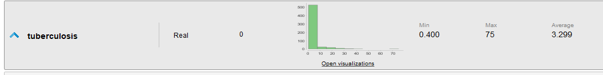
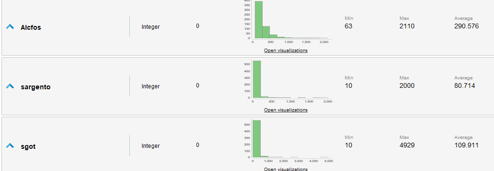
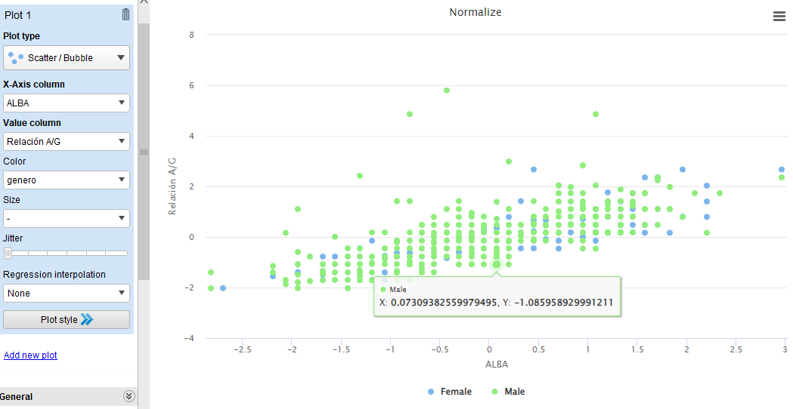
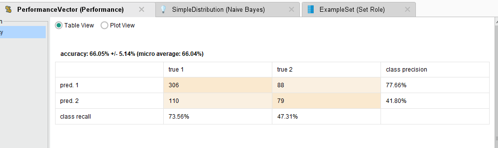
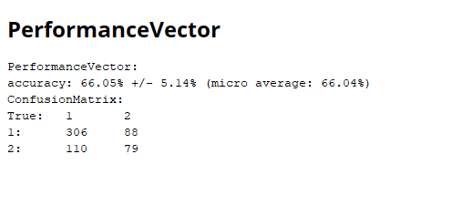

# UCU - Universidad Católica del Uruguay

# Inteligencia Artificial 1

## Primer Parcial

### Alumno: **Juan M. Pérez**

---

# LETRA

ANALISIS DEL PROBLEMA, CONTEXTO Y DOCUMENTACIÓN CORRESPONDIENTE

a. Realiza una revisión sobre el problema de la enfermedad hepática, estadísticas (en diferentes países y regiones), el impacto económico y social asociado y otros problemas relacionados.

## Respuesta INDIAN LIVER PATIENT DATASET

El dataset contiene 583 instancias de datos, 500 de las cuales son no enfermos y 83 enfermos. El dataset contiene 10 variables independientes y 1 variable dependiente. 

Las variables independientes son:

1. Edad, describe la edad del paciente.
2. Sexo, describe el sexo del paciente.
3. tuberculosis, describe la cantidad de bilirrubina total en el suero del paciente.
4. DB, describe la cantidad de bilirrubina directa en el suero del paciente.
5. Alcfos, describe la cantidad de fosfatasa alcalina en el suero del paciente.
6. sargento, describe la cantidad de aminotransferasa sérica del paciente.
7. Sgot, describe la cantidad de aminotransferasa sérica del paciente.
8. TP, la cantidad de proteinas totales
9. ALBA, la cantidad de albúmina
10. Relacion A/G, relación entre albúmina y globulina
11. Selector, Campo selector utilizado para dividir los datos en dos conjuntos (etiquetados por los expertos)

### Caso de estudio en América Latina:

El estudio llevado a cabo en varios países de América Latina revela un cambio en la etiología del carcinoma hepatocelular a lo largo de los años. La investigación se centró en casos de trasplante de hígado entre 2005 y 2012 y encontró que la causa principal de carcinoma hepatocelular solía ser la infección por el virus de la hepatitis C (VHC), pero su incidencia disminuyó significativamente. Por otro lado, los casos atribuibles a esteatosis hepática no alcohólica aumentaron considerablemente, representando la tercera causa más común.

El estudio se basó en una cohorte de adultos en varios países de América Latina, con la mayor contribución de casos provenientes de Brasil, seguido de Argentina, Chile, México, Perú y Uruguay. En el período analizado, la infección por VHC fue la causa principal, seguida por la infección por el virus de la hepatitis B (VHB) y la esteatosis hepática no alcohólica.

Sin embargo, la incidencia de casos relacionados con el VHC disminuyó con el tiempo, mientras que la esteatosis hepática no alcohólica aumentó significativamente. Los investigadores sugieren que este cambio en las causas puede estar relacionado con el tratamiento efectivo del VHC y el aumento de la obesidad y la diabetes en la región.

El estudio destaca que aunque este patrón se observa en toda América Latina, existen variaciones entre los países, con Argentina y Chile mostrando un aumento significativo de la esteatosis hepática no alcohólica como causa de carcinoma hepatocelular.

El autor del estudio enfatiza la importancia de las políticas de salud que promuevan una dieta saludable, reduciendo el consumo de calorías y azúcar, así como la expansión de la vacunación contra el VHB y el tratamiento del VHC como medidas de prevención del carcinoma hepatocelular.

### Impacto social

Este probleme afecta a miles de personas a nivel mundial y con la facilidad que existe hoy en dia para poder obtener todo tipo de sustancias que van en distrimento de la salud, es un problema que va en aumento. 

Este problema afecta no solo a la persona sino tambien a la familia, porque el estado de salud, es muy delicado y requiere de muchos cuidados y atenciones. En Uruguay, el estado se hace cargo de los tratamientos, pero en otros paises, el costo de los tratamientos es muy elevado y no todos pueden acceder a ellos.

El fondo nacional de recursos es el que se encarga de los tratamientos de las personas que padecen esta enfermedad, siendo transplantados en caso de existir algun donante que sea compatible en el grupo sanguineo y en el tipo de higado. Dicho transplante es llevado a cabo en el Hospital Militar donde es a nivel nacional el lugar por excelencia y en vanguardia. 

 

## 2. PREPARACIÓN DE LOS DATOS y ANÁLISIS PREVIO.

a. Al realizar el analisis de los valores se puede observar que no existen valores perdidos, el dataset es completo, pero existen algunos atributos donde la mayoria de los valores son relativamente bajos comparado con la media y existen algunos datos que estan por fuera del rango de lo normal.

Sobre todo en atributos como :

Sargento: media -> 80.7 y max -> 2000
Sgot: media -> 109.9 y max -> 4929
Tuberculosis: media -> 3.3 y max -> 75.0

Para poder solucionar esto se debe normalizar los datos, para que todos los datos esten en el mismo rango y no existan valores que esten por fuera de lo normal.

 

b. Describe las características de los atributos (físicas, estadísticas, correlaciones, etc.). ¿Cuál es el verdadero significado de cada atributo? ¿cuáles son los procedimientos y dificultades para obtener datos correctos de estos atributos?

## Respuesta

Algunas de las relaciones importantes de ver son los valores de Relacion A/G y ALBA, ya que estos valores son los que determinan si el paciente tiene o no cirrosis hepatica. Asimismo como aparece en la imagen inferior determinar que si bien el problema excluyen en cierta forma a las mujeres porque indica la documentacion que es menor la cantidad de casos, es preciso discriminar tambien es estos casos.

Para obtener los datos correctos para este ejercicio es necesario poder ver las correlaciones entre los atributos y poder determinar cuales son los que tienen mayor peso en la determinacion de la enfermedad.
En este caso los atributos que tienen mayor peso son:

1. Sargento
2. Sgot
3. ALBA
4. Relacion A/G

Estos atributos son los que tienen mayor peso en la determinacion de la enfermedad, por lo que se debe tener en cuenta a la hora de realizar el analisis. Poder distinguir entre cada relacion existente entre cada uno es importante para delucidar el problema.

Modelo de Naive Bayes, se utiliza este modelo porque permite clasificar en si es o no enfermo, en base a los atributos que se le pasan. Es un modelo que se utiliza para clasificar y es muy utilizado en problemas de clasificacion.

El otro algorimo que se utilizo fue el de KNN, este algoritmo se utiliza para clasificar y es muy utilizado en problemas de clasificacion. En este caso se utilizo para poder determinar si el paciente es o no enfermo, en base a los atributos que se le pasan.