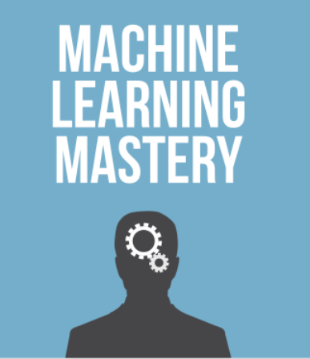
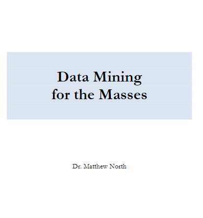
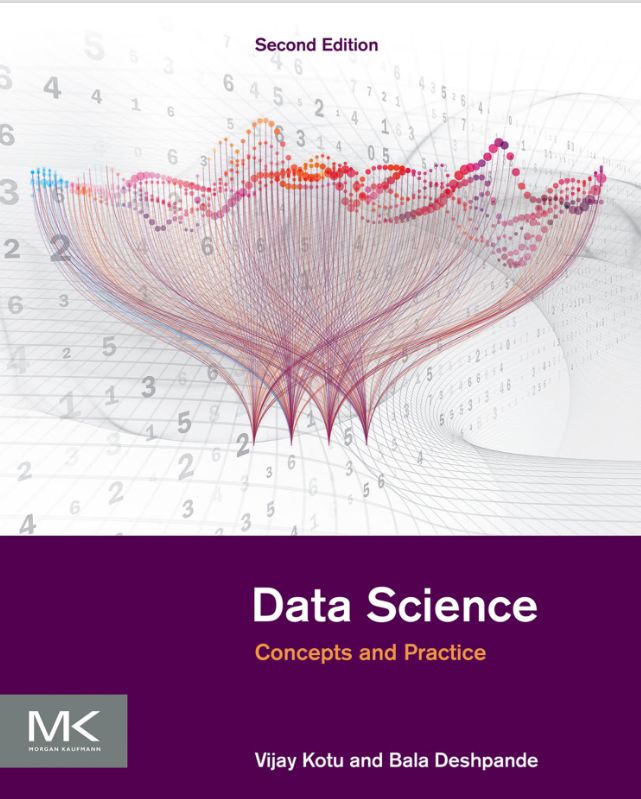
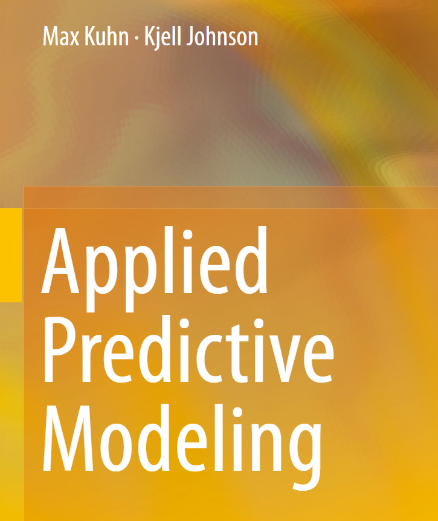
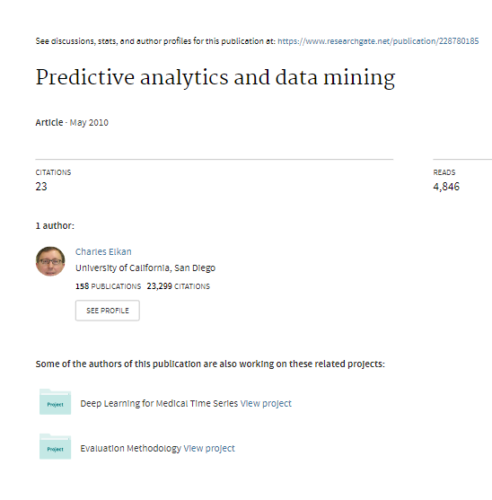
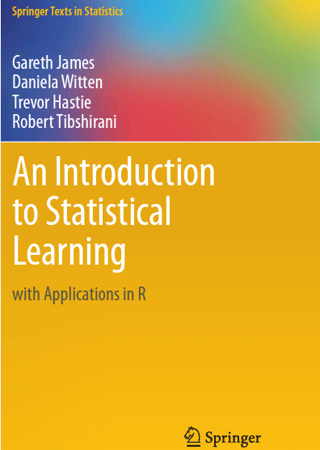

<h1>Portafolio de Juan M. Pérez &#127891;</h1>

Les doy la bienvenida a mi portafolio de la materia Inteligencia Artificial 1, en el cual se encuentran los trabajos realizados durante el 2do semestre del 2023.

En el mismo se encuentran los trabajos realizados, informes por cada unidad y datos relevantes para la materia. Estos datos permiten evaluar el progreso de la materia y el nivel de aprendizaje alcanzado. 

<h2><a href="./UT1">&#128193; Unidad Temática 1 - Introducción al Aprendizaje Automático</a></h2>
  <ul>
    <li><a href="./UT1/Ejercicios">&#128194; Ejercicios</a></li>
    <li><a href="./UT1/Materiales">&#128194; Materiales</a></li>
    <li><a href="./UT1/Resumenes">&#128194; Resúmenes</a></li>
    <li><a href="./UT1/Informe.md">&#128196; Informe</a></li>
  </ul>

<h2><a href="./UT2">&#128193; Unidad Temática 2 - Preparación de datos y fundamentos de ML </a></h2>
  <ul>
    <li><a href="./UT2/Ejercicios">&#128194; Ejercicios</a></li>
    <li><a href="./UT2/Materiales">&#128194; Materiales</a></li>
    <li><a href="./UT2/Resumenes">&#128194; Resúmenes</a></li>
    <li><a href="./UT2/Informe.md">&#128196; Informe</a></li>
  </ul>

<h2><a href="./UT3">&#128193; Unidad Temática 3 - Algoritmos Lineales</a></h2>
  <ul>
    <li><a href="./UT3/Ejercicios">&#128194; Ejercicios</a></li>
    <li><a href="./UT3/Materiales">&#128194; Materiales</a></li>
    <li><a href="./UT3/Resumenes">&#128194; Resúmenes</a></li>
    <li><a href="./UT3/Informe.md">&#128196; Informe</a></li>
  </ul>

<h2><a href="./UT4">&#128193; Unidad Temática 4 - Algoritmos No Lineales</a></h2>
  <ul>
    <li><a href="./UT4/Ejercicios">&#128194; Ejercicios</a></li>
    <li><a href="./UT4/Materiales">&#128194; Materiales</a></li>
    <li><a href="./UT4/Resumenes">&#128194; Resúmenes</a></li>
    <li><a href="./UT4/Informe.md">&#128196; Informe</a></li>
  </ul>

<h2><a href="./BibliografiaCurso">&#128193; Bibliografía</a></h2>
  <ul>
    <li><a href="./BibliografiaCurso/Master Machine Learning Algorithms 2016.pdf" list-style="none">&#128213; Master Machine Learning Algorithms 2016</a>
     </li>
    <li><a href="./BibliografiaCurso/Data Mining For The Masses.pdf">&#128213; Data Mining For The Masses</a>
     </li>
    <li><a href="./BibliografiaCurso/Data-Science-Concepts-and-Practice-2nd-Edition-3.pdf">&#128213; Data Science Concepts and Practice</a>
     </li>
    <li><a href="./BibliografiaCurso/applied predictive modelling.pdf">&#128213; Applied Predictive Modelling</a>
     </li>
    <li><a href="./BibliografiaCurso/Predictive_analytics_and_data_mining.pdf">&#128213; Predictive Analytics and Data Mining</a>
     </li>
    <li><a href="./BibliografiaCurso/ISLR+Seventh+Printing.pdf">&#128213; An Introduction to Statistical Learning</a>
     </li>
  </ul>

Actualización: 16 de octubre de 2023

<!--

### :round_pushpin: [Parciales](./Parciales)
  - [1er Parcial Equipo](./Parciales)
  - [1er Parcial Individual](./Parciales)
  
-->
