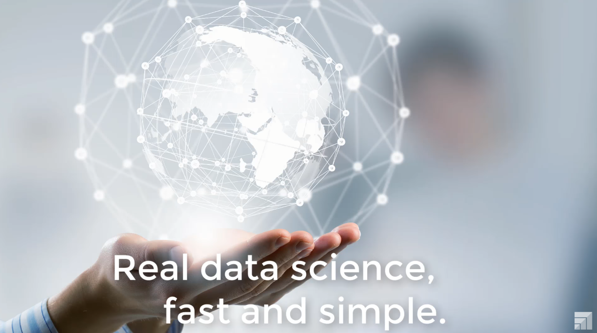
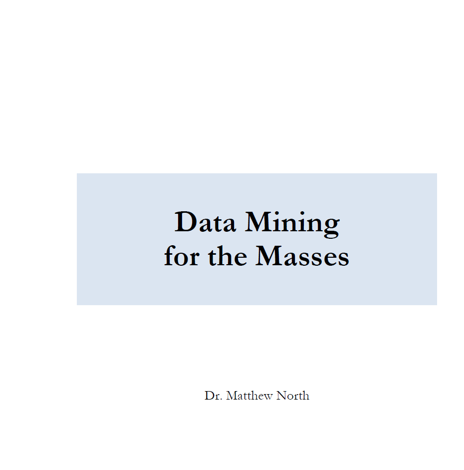

# Lecturas básicas

- Libro “[Master Machine Learning Algorithms](../../BibliografiaCurso/Master%20Machine%20Learning%20Algorithms%202016.pdf)”, capítulos 3 a 7.

  
- Tutoriales RapidMiner, “[Data Handling](https://www.youtube.com/watch?v=vzV3OT2h1Gg&t=94s "Data Handling")”, “1. Handling Missing Values” y “2.Normalization and Outlier detection”
  
 

- Libro “[Data Mining for the masses](../../BibliografiaCurso/DataMiningForTheMasses.pdf "Data Mining for the masses")”, Dr. Matthew North,  capítulo 3 “Data Preparation” (sitio web auxiliar para datos en Data Mining for the Masses, 3e (google.com) 
  

- Libro “Applied Predictive Modelling”, Max Kuhn & Kjell Johnson, capítulo 3 “Data Pre-processing"

