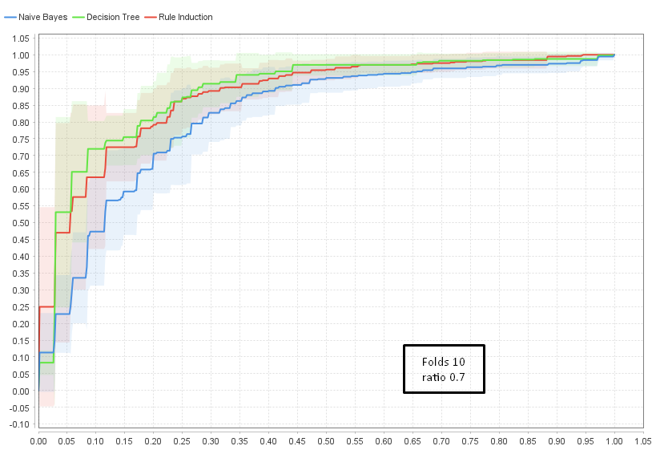
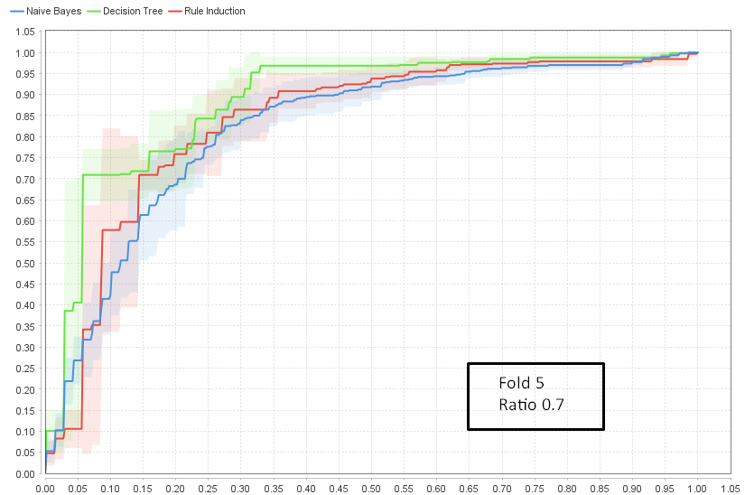

# Unidad Temática 2 - Práctica Dirigida 2 

## Ejercicio 1 - Tutoriales RapidMiner

 
 

# "Modeling"

Este tutorial consiste en la utilización del dataset de ejemplo "Titanic Training" para la creación de un modelo de predicción de supervivencia de los pasajeros del Titanic. Para realizar el modelado se utilizó el algoritmo de árbol de decisión `"Decision Tree"`, el cual se encuentra en la categoría de algoritmos de `"Modeling"`. 

Como resultado al ejecutar el proceso se obtiene un modelo de predicción de supervivencia de los pasajeros del Titanic, en el cual se van comparando los diferentes factores que incidieron en la supervivencia de los pasajeros. En cada nodo del árbol se puede observar en la etiqueta cual es el factor que se está evaluando y hacia donde se dirige el flujo de datos.

El modelo `"Rule Induction"` muestra los factores que influyeron en la supervivencia de los pasajeros del Titanic, en este caso se puede observar que el factor más importante fue el sexo, seguido de la clase en la que viajaban y la edad. Y el `"Naive Bayes"` muestra la probabilidad de supervivencia de los pasajeros del Titanic, en este caso se puede observar que la probabilidad de supervivencia es mayor en las mujeres que en los hombres.

 

# "Scoring"

En este tutorial se utiliza el dataset de ejemplo `"Titanic Training"` conectado al modelo de predicción `"Naive Bayes"` y aplicando un modelo en conjunto con el dataset `"Titanic Unlabeled"` para predecir la supervivencia de los pasajeros del Titanic. Estos dataset cuentan con un total de 392 registros de ejemplos y 6 atributos, los cuales son:
* Age
* Passenger Class
* Sex
* Number of parents or children on board
* Number of siblings or spouses on board
* Passenger fare

El resultado del `"Apply Model"` muestra la predicción de supervivencia de los pasajeros del Titanic, con un porcentaje de confidencia de la predicción que indica que tan seguro es el resultado de la misma. En este caso se puede observar que el número de mujeres con posible supervivencia es mayor que el número de hombres con posible supervivencia.

 

# "Test Split and Validation"

En este caso se utiliza el dataset `"Titanic Training"` conectado a un operador `"Split data"` configurado en un 70% para entrenamiento y un 30% para validación, y conectado a un modelo de predicción `"Naive Bayes"` para predecir la supervivencia de los pasajeros del Titanic.

El resultado del `"Apply Model"` muestra la predicción de supervivencia de los pasajeros del Titanic, con un porcentaje de confidencia de la predicción que indica que tan seguro es el resultado de la misma. Se observan casos donde la predicción es correcta y otros donde la predicción es incorrecta, ejemplo de esto la predicción de "no" supervivencia de 29 casos siendo que realmente si sobrevivieron y analogamente 25 casos con predicción de "si" supervivencia siendo que realmente no sobrevivieron. 

La presición de esta predicción se muestra en el entorno de los 80,36% de aciertos, lo cual es un buen resultado para este tipo de predicciones. 

| |true yes|true no|class precision|
|---|---|---|---|
|predicted yes|  76 |  25 |  75,25% |
|predicted no |  29 |  145 |  83,33% |
|class recall |  72,72% |  85,29% |  |

 

# "Cross Validation"

En este caso se utiliza el dataset `"Titanic Training"` conectado a un operador `"Cross Validation"` configurado en 10 folds y conectado a un modelo de predicción `"Decision Tree"` para predecir la supervivencia de los pasajeros del Titanic. Como hemos visto en los anteriores ejercicios este dataset tiene 392 registros de ejemplos y 6 atributos. 

El nivel de performance del modelo de predicción se muestra en el entorno de los 80,35% de aciertos, con un margen de +/- 4.69% de error, lo cual es un buen resultado para este tipo de predicciones. 

| |true yes|true no|class precision|
|---|---|---|---|
|predicted yes|  253 |  84 |  75.07% |
|predicted no |  96 |  483 |  83.42% |
|class recall |  72.49% |  85.19% |  |

> Accuracy: 80.35% +/- 4.69%
> 
> Precision: 83.63% +/- 4.49%
> 
> Recall: 85.19% +/- 6.75%

Después de bajar a 6 el folds del operador `"Cross Validation"` se obtuvo un nivel de performance del modelo de predicción en el entorno de los 79.14% de aciertos, con un margen de +/- 3.24% de error.

 

# "Visual Model Comparison"

Finalmente en esta etapa del tutorial se utiliza el dataset `"Titanic Training"` conectado al operador `"Compare ROCs"` configurado en 10 folds y conectado a tres modelos de predicción `"Decision Tree"`, `"Naive Bayes"` y `"Rule Induction"`. 

Al ejecutar el proceso se obtiene un gráfico de comparación de los modelos de predicción, en el cual se puede observar que el modelo de predicción con peor performance para este ejemplo es el de `"Naive Bayes"` ya que es el que más se aleja de la esquina superior izquierda del gráfico y su curva es la inferior. El modelo de predicción con mejor performance para este ejemplo es el de `"Decision Tree"` ya que es el que más se acerca a la esquina superior izquierda del gráfico y su curva es la superior.

Para evaluar el comportamiento de los 3 modelos de predicción se puede modificar el número de folds del operador `"Compare ROCs"`, al colocarlo en 5 se puede observar como la diferencia entre las distintas curvas disminuye.

