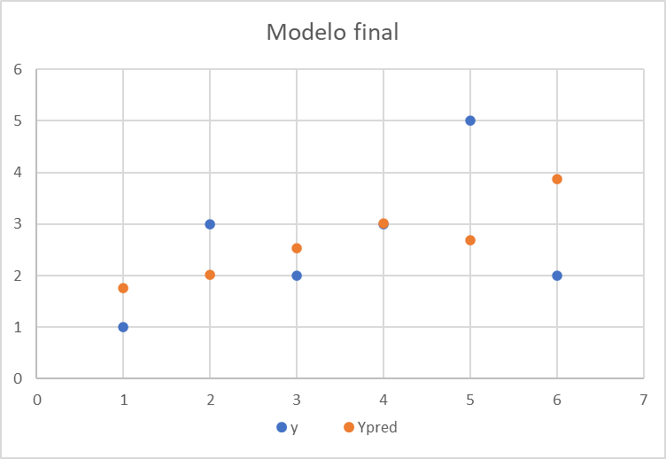
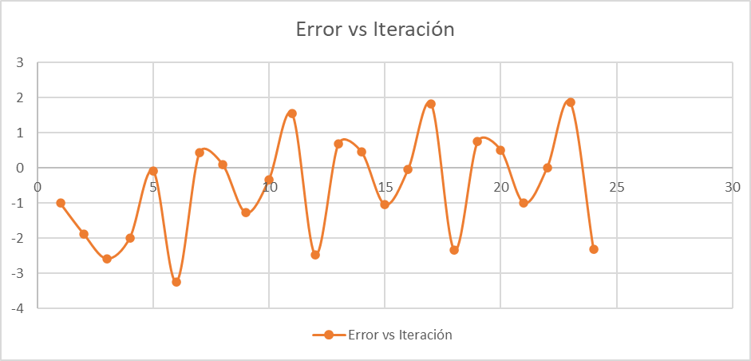

# Unidad Temática 3

## Práctico Domiciliario 1

## Materia: **Inteligencia Artificial 1** 

### Estudiante:

**Juan M. Pérez**

 

---

 

## Ejercicio 1 - Regresión lineal con descenso de gradiente

Dadas los siguientes datos `x = {1, 3, 2, 4, 6, 5}` y `y = {1, 2, 3, 3, 2, 5}`, utilizar una planilla excel para realizar gráfico de puntos.

Realizar entre 18 - 24 iteraciones del algoritmo de descenso de gradiente para encontrar los valores de $\beta_0$ y $\beta_1$.

### Preguntas

**a.** ¿Cuántas iteraciones serían apropiadas? ¿Podemos hacerlo adaptivo?

Se puede hacer adaptivo, pero para este caso se realizaron 24 iteraciones. Se puede observar que a partir de la iteración 18 el valor de $\beta_0$ y $\beta_1$ no varían significativamente.

**b.** ¿Cuáles son los valores de B0 y B1 de todas las iteraciones? (mostrar una tabla) ¿cómo queda el modelo final?

El modelo final queda de la siguiente manera:

$$ y = 1,33049655985312 + 0,433627710131973 * x $$

**c.** Graficar el error de predicción vs. iteraciones

**d.** Calcular el error cuadrático medio, y comparar con el obtenido en el TA1

$$RMSE = \sqrt{\frac{\sum_{i=1}^{n} (p_i - y_i)^2}{n}}$$

El RMSE del TA1 es de 1,10122586815712 y en este caso el valor es de 0,0415144423295563.

La diferencia entre ambos valores se debe a que en el TA1 se utilizó la fórmula de la regresión lineal simple, mientras que en este caso se utilizó el algoritmo de descenso de gradiente.

**e.** Generar valores de entrada entre 0 y 8, con paso 0.1, aplicar el modelo y graficar los resultados.

**f.** Analizar los datos de entrada desde la óptica de los requerimientos a tener en cuenta para aplicar un método de regresión lineal (listar y argumentar)

- Los datos deben ser continuos, no pueden ser discretos.
- Los datos deben estar correlacionados, que exista una relación entre ellos, de lo contrario no se puede aplicar regresión lineal.
- Los datos deben tener distribución normal, que la mayoría de los datos se encuentren en el centro de la distribución y que los datos se distribuyan de manera simétrica.
- Los datos deben tener independencia, que no exista relación entre ellos.

