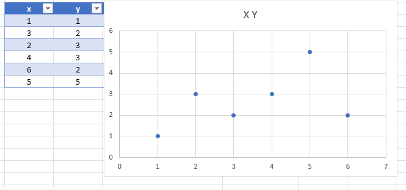
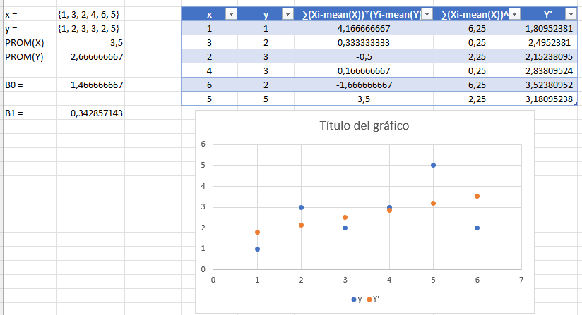
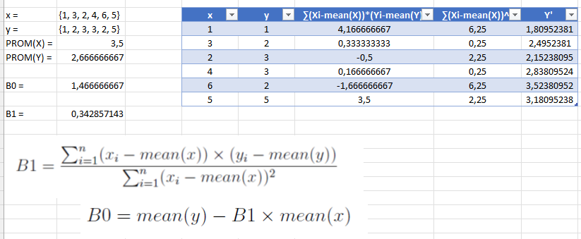
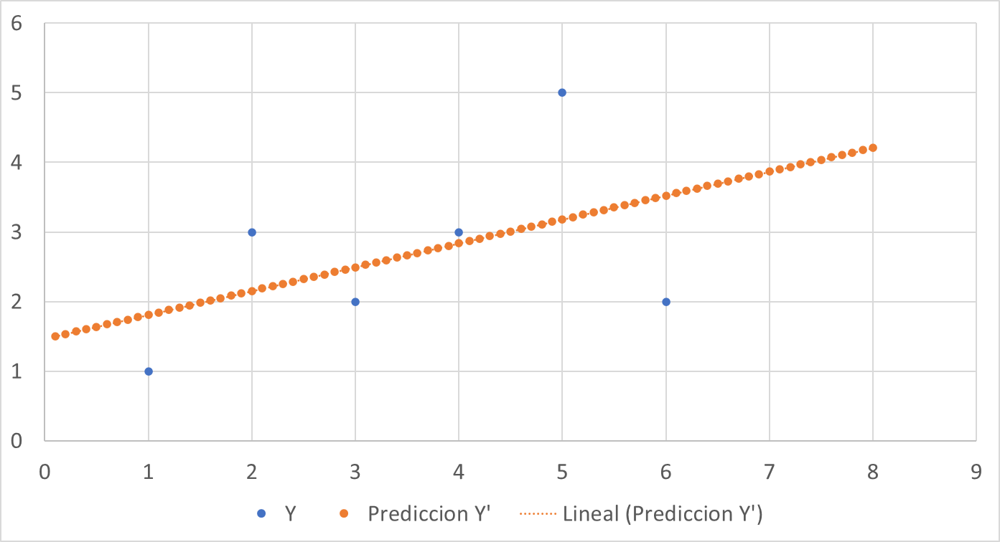
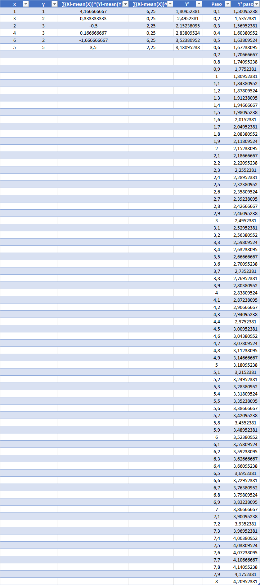
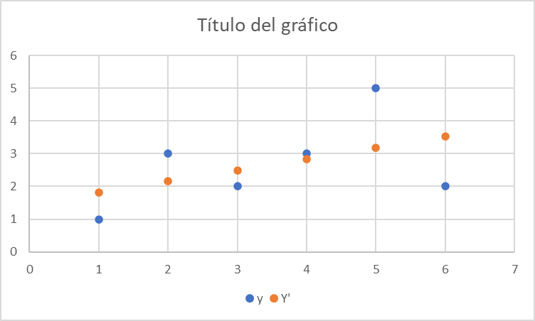
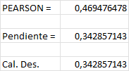
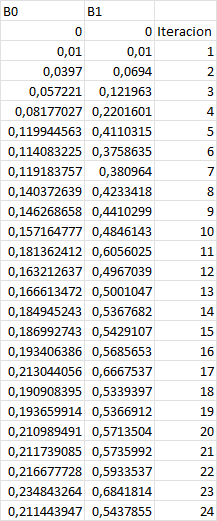
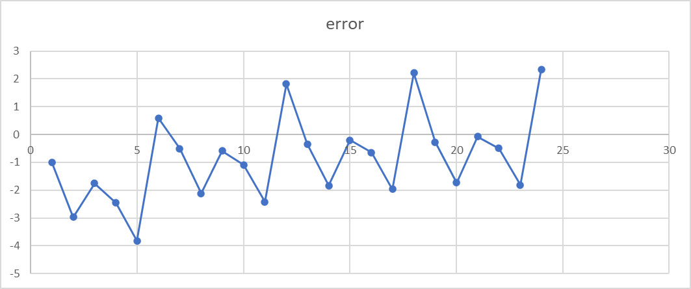
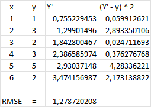

# Unidad Temática 3

## Trabajo de Aplicacion 1

## Materia: **Inteligencia Artificial 1** 

### Estudiante:

**Juan M. Pérez**

  

---

 

# Ejercicio 1

Dadas los siguientes datos `x = {1, 3, 2, 4, 6, 5}` y `y = {1, 2, 3, 3, 2, 5}`, utilizar una planilla excel para realizar gráfico de puntos.

Crear un modelo de regresión lineal simple para predecir `y` a partir de `x`.

$y = \beta_0 + \beta_1 * x$

 

Utilizando la formula de la regresión lineal simple, calcular los coeficientes $\beta_0$ y $\beta_1$.

$\beta_1 = \frac{\sum_{i=1}^{n} (x_i - mean(x)) * (y_i - mean(y))}{\sum_{i=1}^{n} (x_i - mean(x))^2}$

$\beta_0 = mean(y) - \beta_1 * mean(x)$

$\beta_1 = 0.34285$ y $\beta_0 = 1.46667$

 

Hacer predicciones de `y` para los valores de `x = {0, 8}` con paso de 0,1.

 

Estimación del Error de Predicción.

$RMSE = \sqrt{\frac{\sum_{i=1}^{n} (p_i - y_i)^2}{n}}$

El error medio cuadrático se calcula como la raíz cuadrada de la media de los errores al cuadrado. Esto nos da una idea de cuán cerca están los valores predichos de los valores reales.

A continuación se muestra graficamente la diferencia entre los valores reales y los predichos.

En este caso el RMSE es de 1,10122586815712.

 
Forma alternativa de calcular el valor de B1 utilizando el desvio estandar.
En la planilla de excel se puede utilizar la función `Pendiente` o realizando la operación en forma desarrollada de la siguiente manera:

$\beta_1 = corr(x;y) * \frac{desvest(y)}{desvest(x)}$

Si utilizamos la funcion `PEARSON` como se sugiere en el ejercicio el resultado seria: 0,469476477861571.
Utilizando la funcion Pendiente o el calculo desarrollado el resultado es: 0,342857142857143, que es igual al calculado inicialmente.

 
 

---

 

# Ejercicio 2 Regresión lineal con descenso de gradiente (1) 

Minimizar una funcion siguiendo los gradientes de la función de costo.
Necesitamos conocer la funcion de costo y sus derivadas.
Moverse "hacia abajo" según el gradiente
Las instancias se presentan al modelo de a una por vez
El modelo hace una predicción, se calcula el error y se actualiza el modeo para reducir el error de la proxima predicción.
En cada iteración se actualizan los "pesos" (coeficientes) del modelo.

$w = w + alpha * delta$

Donde ` alfa ` es la tasa de aprendizaje y ` delta ` es el error.

y = 0.0 + 0.0 * x

error = p(i) - y(i)

p(i) = 0.0 + 0.0 * 1 = 0.0 , error = 0.0 - 1 = -1

B0 (t+1) = B0(t) - alpha × error = 0.0 - 0.01 * -1 = 0.01

B1 (t+1) = B1(t) - alpha * error * x 
B1 (t+1) = 0.0 - 0.01 * -1 * 1 = 0.01

Realizar 24 iteraciones sería apropiado para este problema, porque habremos estudiado 4 ciclos completos de los datos de entrenamiento.

Acontinuación se listan los valores de B0 y B1 para cada iteración.

 

Asimismo se realiza una grafica para apreciar el error en cada iteración.

 

Finalmente se realiza el calculo del error cuadratico medio (RMSE) para los valores obtenidos.

