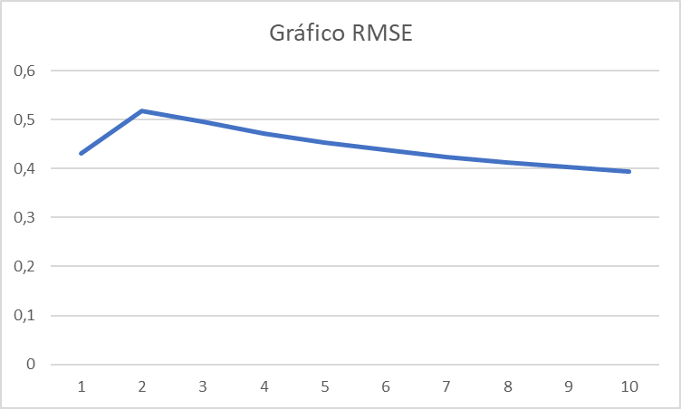

# Unidad Temática 3

## Trabajo de Aplicacion 3

## Materia: **Inteligencia Artificial 1** 

### Estudiante:

**Juan M. Pérez**

  

---

 

## Ejercicio 1

### Enunciado 

> Generar una tabla de X e Y en excel, donde X es generado aleatoriamente con una distribución normal estandar, e Y es calculado con la función logística. Luego, generar un gráfico de dispersión de los datos.

¿Es una función continua?

Si, es una función continua, ya que no hay saltos en los valores de Y, y para cada valor de X, hay un valor de Y.

¿No era que la regresión logística es para clasificación, particularmente de 2 clases?

Si, pero en este caso, estamos usando la función logística para generar los valores de Y, y no para clasificar. Si bien la clasificación es el uso más común de la regresión logística, también se puede usar para generar valores continuos, como en este caso.

 

---

 

## Ejercicio 2

### Enunciado

> Generar una tabla de X e Y en excel, dados los siguientes datos:

 

Generar un gráfico de dispersión de los datos, con 2 series, una para Y = 0 y otra para Y = 1.

 

¿Cómo se ven los ejemplos en cuanto a su clasificación?

Se puede apreciar claramente, como los puntos que corresponden a la serie Y=0 se ubican más hacia la izquierda, y los puntos que corresponden a la serie Y=1 se ubican más hacia la derecha. 

Recordemos que el modelo de regresión logística, para este problema, sería:
salida = B0 + B1 × X1 + B2 × X2
el algoritmo de aprendizaje debe encontrar los mejores coeficientes (B0, B1 y B2) en función de los datos de entrenamiento

 

Comenzamos asignando un valor inicial 0.0 a los tres coeficientes B0, B1 y B2

Con estos valores, ¿cuánto da la predicción?

Con estos valores la predicción da 0.5, siendo los valores de B0= -0.0375, B1= -0.10429 y B2= -0.0956 aproximadamente.

 

Al repetir este proceso en lo que llamamos epocas, ¿cómo se van modificando los coeficientes?

Los valores finales se convierten en B0= -0,406615108805474, B1= 0,852574363967343 y B2= -1,1047437492204.

Obteniendo la siguiente tabla de predicción:

 

El calculo de las RMSE por cada epoca se aprecia en la siguiente tabla y su correspondiente gráfico:

 

Siendo las predicciones para cada epoca las que figuran en la siguiente tabla:

 

El error de clase se calcula como las veces que la predicción no cumple con la clase original, de aquí surge la exactitud que se va realizando en cada epoca, se puede apreciar en la siguiente tabla y su correspondiente gráfico:

 

¿Cuales son los valores finales, nivel de exactitud y predicciones?

Como se puede apreciar en la siguiente imagen se responden las interrogantes:

 

---

 

Cambiar el conjunto de datos a los siguientes:

 

El nuevo grafico de dispersión de los datos, con 2 series, una para Y = 0 y otra para Y = 1.

 

Se muestran los datos y las graficas obtenidas de hacer el estudio con epocas:

grafico de exactitud y epocas

