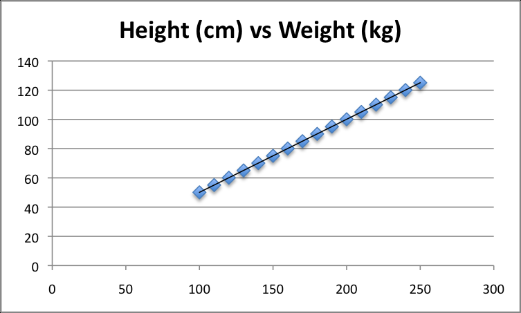

# Resumen del libro "Master Machine Learning Algorithms"

## Capítulo 9 - Gradient Descent for Machine Learning

La optimización es una parte importante en Machine Learning. En este capitulo descubriras un algoritmo simple que se puede utilizar en todos los casos de Machine Learning.

### 9.1 - Gradient Descent (Descenso de Gradiente)

Se usa para encontrar valores de parámetros (coeficientes) para una función $f$ que minimiza el costo de la función $cost$.

#### Gradient Descent Procedure

Comenzar con valores de coeficiente = 0.0 o pequeños valores aleatorios.
El costo de la función se calcula para cada coeficiente.
$$cost = f(coeficiente)$$
$$cost = evaluate(f(coeficiente))$$

Se requiere conocer la `pendiente` y la dirección `signo`, para mover el coeficiente en orden.
$$delta = derivate(cost)$$

Ahora que sabemos por la derivada qué dirección es cuesta abajo, podemos actualizar los valores del coeficiente. Se debe especificar un parámetro de tasa de aprendizaje (alfa) que controle cuánto pueden cambiar los coeficientes en cada actualización.

$$coeficiente = coeficiente - (alfa * delta)$$

El proceso se repite hasta que el costo de los coeficientes sea 0.0 o no se puedan lograr más mejoras en el costo.

### 9.2 Batch Gradient Descent

La meta de todo algoritmo de ML supervisado es estimar mejor una función objetivo (f) que asigna datos de entrada (X) a variables de salida (Y). 

Ejemplos comunes de algoritmos con coeficientes que se pueden optimizar mediante el descenso de gradiente son la regresión lineal y la regresión logística.

Cada iteracion del algoritmo es llamado `batch` o lote, y la forma de descenso de gradiente se denomina `batch gradient descent` (o descenso gradiente por lotes), porque el algoritmo revisa todos los ejemplos en el conjunto de datos de entrenamiento en cada iteración. 

### 9.3 Stochastic Gradient Descent

El descenso de gradiente puede ser lento en dataset muy grandes. 
En esta variación, se ejecuta el procedimiento de descenso de gradiente descrito anteriormente, pero la actualización de los coeficientes se realiza para cada instancia de entrenamiento, en lugar de al final del lote de instancias.

El primer paso del procedimiento requiere un dataset de entrenamiento ordenado aleatoriamente. Esto es para mezclar el orden en que se realizan las actualizaciones de los coeficientes. Debido a que los coeficientes se actualizan después de cada instancia de entrenamiento, las actualizaciones serán ruidosas y saltarán por todos lados, al igual que la función de costo correspondiente. Al mezclar el orden de las actualizaciones de los coeficientes, aprovecha este recorrido aleatorio y evita quedarse atascado.

### 9.4 Tips for Gradient Descent

- **Plot Cost vs Time**: Recopile y registre los costos en cada iteración del algoritmo. En un buen descenso de gradiente, esperamos que el costo disminuya en cada iteración. Si no ocurre, considere reducir la tasa de aprendizaje.
- **Learning Rate**: El rango es pequeño 0.1, 0.001 o 0.0001.
- **Rescale Inputs**: Los valores de entrada pueden ser escalados entre 0 y 1. Esto puede ayudar al descenso de gradiente a converger en menos iteraciones.
- **Few Pases**: Stochastic Gradient Descent normalmente se ejecuta en pocas iteraciones a través del dataset de entrenamiento, quizás 1 a 10 veces a través del dataset de entrenamiento.
- **Plot Mean Cost**: ELas actualizaciones para cada instancia de dataset de entrenamiento puede resultar en una estimación ruidosa del costo, sobre la sthocastic gradient descent.  Tomando un promedio de 10, 100 o 1000 actualizaciones puede proporcionar una mejor estimación del costo para cada iteración del algoritmo.
  

## Capítulo 10 - Linear Regression

La regresión lineal es un algoritmo de aprendizaje automático supervisado para la predicción de valores reales (números). Es usado en Estadística y Machine Learning.

### 10.1 - Isn't Linear Regression from Statistics?

Regresion lineal fue desarrollado por el campo de la estadística y es estudiado como un modelo para entender la relación entre entrada y salida de variables numéricas, pero a sido tomado prestado por la Machine Learning. 

### 10.2 - Many Names of Linear Regression

Estudia la relacion lineal entre una variable de entrada $x$ y una unica variable de salida $y$. Más específicamente, esa $y$ puede ser calculada desde la combinacion lineal de variables de entrada $x$. Cuando hay una sola variable de entrada, el método se denomina `regresion lineal simple`. Cuando hay multiples variables de entrada, se denomina `regresion lineal multiple`.

Diferentes tecnicas pueden ser usadas para preparar o entrenar la ecuación de regresion lineal desde los datos, la mas comun es llamada `Ordinary Least Squares` o `OLS`. Por lo tanto, es común referirse a un modelo preparado de esta manera como Regresión Lineal de Mínimos Cuadrados Ordinarios o simplemente Regresión de Mínimos Cuadrados.

### 10.3 - Linear Regression Model Representation

La regresión lineal es atractiva debido a su simplicidad. Se representa mediante una ecuación lineal que combina un conjunto específico de valores de entrada (x) para predecir un valor de salida (y). Los valores de entrada y salida son numéricos.

La ecuación lineal asigna un coeficiente a cada valor de entrada, comúnmente representado como Beta (β), y se agrega un coeficiente adicional llamado intercepto. En problemas de regresión simple, la ecuación toma la forma $$y = B0 + B1 * x.$$

En dimensiones más altas, se habla de planos o hiperplanos. La complejidad de un modelo de regresión, como la regresión lineal, se relaciona con la cantidad de coeficientes utilizados. Cuando un coeficiente se vuelve cero, elimina la influencia de la variable de entrada en el modelo y en las predicciones.

### 10.4 - Linear Regression Learning the Model

El modelo de regresión lineal se compone de cuatro tecnica de aprendizaje diferentes:

#### 10.4.1 - Simple Linear Regression

Dada una variable de entrada (x), podemos usar estadistica para estimar el coeficiente. Esto requiere calcular propiedades estadisticas específicas de los datos de entrada, como la media, la varianza y los coeficientes de correlación. Esto es divertido como ejercicio en una hoja de cálculo, pero no es realmente útil en la práctica.

#### 10.4.2 - Ordinary Least Squares

Mínimos cuadrados ordinarios
Cuando tenemos más de una entrada podemos usar mínimos cuadrados ordinarios para estimar los valores de los coeficientes. El procedimiento de Mínimos Cuadrados Ordinarios busca minimizar la suma de los residuos al cuadrado. Esto significa que, dada una línea de regresión a través de los datos, calculamos la distancia desde cada punto de datos hasta la línea de regresión, la elevamos al cuadrado y sumamos todos los errores al cuadrado. Ésta es la cantidad que los mínimos cuadrados ordinarios buscan minimizar. 

Este enfoque trata los datos como una matriz y utiliza operaciones de álgebra lineal para estimar los valores óptimos de los coeficientes. Significa que todos los datos deben estar disponibles y debe tener suficiente memoria para ajustar los datos y realizar operaciones matriciales. Es inusual implementar el procedimiento de mínimos cuadrados ordinarios usted mismo a menos que sea un ejercicio de álgebra lineal. Es más probable que llame a un procedimiento en una biblioteca de álgebra lineal. Este procedimiento es muy rápido de calcular.

### 10.5 - Gradient Descent

Cuando hay una o más entradas, puede utilizar un proceso de optimización de los valores de los coeficientes minimizando iterativamente el error del modelo en sus datos de entrenamiento. Esta operación se llama Descenso de gradiente y funciona comenzando con valores cero para cada coeficiente.
La suma de los errores cuadrados se calcula para cada par de valores de entrada y salida. Se utiliza una tasa de aprendizaje como factor de escala y los coeficientes se actualizan en la dirección de minimizar el error. El proceso se repite hasta que se logra un error de suma cuadrática mínimo o no es posible realizar más mejoras.
Al utilizar este método, debe seleccionar un parámetro de tasa de aprendizaje (alfa) que determine el tamaño del paso de mejora a realizar en cada iteración del procedimiento. El descenso de gradientes a menudo se enseña mediante un modelo de regresión lineal porque es relativamente sencillo de entender.
En la práctica, es útil cuando se tiene un conjunto de datos muy grande, ya sea en número de filas o en número de columnas, que tal vez no quepan en la memoria.

#### 10.5.1 - Regularized Linear Regression

Dos ejemplos populares de procedimientos de regularización para regresión lineal son:
* Regresión de lazo: donde se modifican los mínimos cuadrados ordinarios para minimizar también la suma absoluta de los coeficientes (llamada regularización $L1$).
* Regresión de cresta: donde se modifican los mínimos cuadrados ordinarios para minimizar también la suma cuadrada absoluta de los coeficientes (llamada regularización $L2$).
  
Estos métodos son eficaces cuando hay colinealidad en los valores de entrada y los mínimos cuadrados ordinarios sobreajustarían los datos de entrenamiento. Ahora que conoce algunas técnicas para aprender los coeficientes en un modelo de regresión lineal, veamos cómo podemos usar un modelo para hacer predicciones sobre nuevos datos.

### 10.6 - Make Predictions with Linear Regression

Dada la representación es una ecuación lineal, podemos predecirla simplemente resolviendo un conjunto especifico de entradas. Imaginemos que predecimos el peso $y$ a partir de la altura $x$. Nuestro modelo de regresión lineal se vería así: $$y = B0 + B1 * X1$$
$$peso = B0 + B1 * altura$$

Si le damos valores se veria así, usaremos B0 = 0.1 y B1 = 0.5: $$peso = 0.1 + 0.5 * altura$$
La altura es de 176 cm, entonces: $$peso = 0.1 + 0.5 * 176$$
$$peso = 88.1$$

### 10.7 - Prepare Data for Linear Regression

La regresión lineal a sido estudiada en gran profundidad, y hay muchos documentos sobre como debes estructurar los datos de mejor manera para usar el modelo. En la practica Ordinary Least Squares Regression es implementacion más común. 

**Linear Assumption**: La regresión lineal supone que la relación entre la entrada y la salida es lineal. No soporta nada más. Esto puede parecer obvio, pero es bueno recordarlo cuando tienes muchos atributos. Es posible que necesite transformar datos para que la relación sea lineal (por ejemplo, transformación logarítmica para una relación exponencial).

**Remove Noise**: La regresión lineal supone que las variables de entrada y salida no son ruidosas. Considere la posibilidad de utilizar operaciones de limpieza de datos que le permitan exponer y aclarar mejor la señal de sus datos. Esto es muy importante para la variable de salida y, si es posible, desea eliminar los valores atípicos en la variable de salida (y).

**Remove Collinearity**: La regresión lineal sobrepasará sus datos cuando tenga variables de entrada altamente correlacionadas. Considere calcular correlaciones por pares para sus datos de entrada y eliminar los más correlacionados.

**Gaussian Distributions**: La regresión lineal hará predicciones más confiables si sus variables de entrada y salida tienen una distribución gaussiana. Puede obtener algún beneficio utilizando transformaciones (por ejemplo, log o BoxCox) en sus variables para hacer que su distribución sea más gaussiana.

**Rescale Inputs**: La regresión lineal a menudo generará predicciones más confiables si reescala las variables de entrada mediante estandarización o normalización.