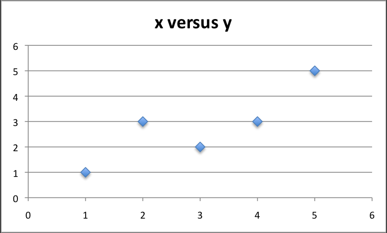

# Resumen del libro "Master Machine Learning Algorithms"

## Capítulo 9 - Gradient Descent for Machine Learning

La optimización es una parte importante en Machine Learning. En este capitulo descubriras un algoritmo simple que se puede utilizar en todos los casos de Machine Learning.

### 9.1 - Gradient Descent (Descenso de Gradiente)

Se usa para encontrar valores de parámetros (coeficientes) para una función $f$ que minimiza el costo de la función $cost$.

#### Gradient Descent Procedure

Comenzar con valores de coeficiente = 0.0 o pequeños valores aleatorios.
El costo de la función se calcula para cada coeficiente.
$$cost = f(coeficiente)$$
$$cost = evaluate(f(coeficiente))$$

Se requiere conocer la `pendiente` y la dirección `signo`, para mover el coeficiente en orden.
$$delta = derivate(cost)$$

Ahora que sabemos por la derivada qué dirección es cuesta abajo, podemos actualizar los valores del coeficiente. Se debe especificar un parámetro de tasa de aprendizaje (alfa) que controle cuánto pueden cambiar los coeficientes en cada actualización.

$$coeficiente = coeficiente - (alfa * delta)$$

El proceso se repite hasta que el costo de los coeficientes sea 0.0 o no se puedan lograr más mejoras en el costo.

### 9.2 Batch Gradient Descent

La meta de todo algoritmo de ML supervisado es estimar mejor una función objetivo (f) que asigna datos de entrada (X) a variables de salida (Y). 

Ejemplos comunes de algoritmos con coeficientes que se pueden optimizar mediante el descenso de gradiente son la regresión lineal y la regresión logística.

Cada iteracion del algoritmo es llamado `batch` o lote, y la forma de descenso de gradiente se denomina `batch gradient descent` (o descenso gradiente por lotes), porque el algoritmo revisa todos los ejemplos en el conjunto de datos de entrenamiento en cada iteración. 

### 9.3 Stochastic Gradient Descent

El descenso de gradiente puede ser lento en dataset muy grandes. 
En esta variación, se ejecuta el procedimiento de descenso de gradiente descrito anteriormente, pero la actualización de los coeficientes se realiza para cada instancia de entrenamiento, en lugar de al final del lote de instancias.

El primer paso del procedimiento requiere un dataset de entrenamiento ordenado aleatoriamente. Esto es para mezclar el orden en que se realizan las actualizaciones de los coeficientes. Debido a que los coeficientes se actualizan después de cada instancia de entrenamiento, las actualizaciones serán ruidosas y saltarán por todos lados, al igual que la función de costo correspondiente. Al mezclar el orden de las actualizaciones de los coeficientes, aprovecha este recorrido aleatorio y evita quedarse atascado.

### 9.4 Tips for Gradient Descent

- **Plot Cost vs Time**: Recopile y registre los costos en cada iteración del algoritmo. En un buen descenso de gradiente, esperamos que el costo disminuya en cada iteración. Si no ocurre, considere reducir la tasa de aprendizaje.
- **Learning Rate**: El rango es pequeño 0.1, 0.001 o 0.0001.
- **Rescale Inputs**: Los valores de entrada pueden ser escalados entre 0 y 1. Esto puede ayudar al descenso de gradiente a converger en menos iteraciones.
- **Few Pases**: Stochastic Gradient Descent normalmente se ejecuta en pocas iteraciones a través del dataset de entrenamiento, quizás 1 a 10 veces a través del dataset de entrenamiento.
- **Plot Mean Cost**: ELas actualizaciones para cada instancia de dataset de entrenamiento puede resultar en una estimación ruidosa del costo, sobre la sthocastic gradient descent.  Tomando un promedio de 10, 100 o 1000 actualizaciones puede proporcionar una mejor estimación del costo para cada iteración del algoritmo.
  

## Capítulo 10 - Linear Regression

La regresión lineal es un algoritmo de aprendizaje automático supervisado para la predicción de valores reales (números). Es usado en Estadística y Machine Learning.

### 10.1 - Isn't Linear Regression from Statistics?

Regresion lineal fue desarrollado por el campo de la estadística y es estudiado como un modelo para entender la relación entre entrada y salida de variables numéricas, pero a sido tomado prestado por la Machine Learning. 

### 10.2 - Many Names of Linear Regression

Estudia la relacion lineal entre una variable de entrada $x$ y una unica variable de salida $y$. Más específicamente, esa $y$ puede ser calculada desde la combinacion lineal de variables de entrada $x$. Cuando hay una sola variable de entrada, el método se denomina `regresion lineal simple`. Cuando hay multiples variables de entrada, se denomina `regresion lineal multiple`.

Diferentes tecnicas pueden ser usadas para preparar o entrenar la ecuación de regresion lineal desde los datos, la mas comun es llamada `Ordinary Least Squares` o `OLS`. Por lo tanto, es común referirse a un modelo preparado de esta manera como Regresión Lineal de Mínimos Cuadrados Ordinarios o simplemente Regresión de Mínimos Cuadrados.

### 10.3 - Linear Regression Model Representation

La regresión lineal es atractiva debido a su simplicidad. Se representa mediante una ecuación lineal que combina un conjunto específico de valores de entrada (x) para predecir un valor de salida (y). Los valores de entrada y salida son numéricos.

La ecuación lineal asigna un coeficiente a cada valor de entrada, comúnmente representado como Beta (β), y se agrega un coeficiente adicional llamado intercepto. En problemas de regresión simple, la ecuación toma la forma $$y = B0 + B1 * x.$$

En dimensiones más altas, se habla de planos o hiperplanos. La complejidad de un modelo de regresión, como la regresión lineal, se relaciona con la cantidad de coeficientes utilizados. Cuando un coeficiente se vuelve cero, elimina la influencia de la variable de entrada en el modelo y en las predicciones.

### 10.4 - Linear Regression Learning the Model

El modelo de regresión lineal se compone de cuatro tecnica de aprendizaje diferentes:

#### 10.4.1 - Simple Linear Regression

Dada una variable de entrada (x), podemos usar estadistica para estimar el coeficiente. Esto requiere calcular propiedades estadisticas específicas de los datos de entrada, como la media, la varianza y los coeficientes de correlación. Esto es divertido como ejercicio en una hoja de cálculo, pero no es realmente útil en la práctica.

#### 10.4.2 - Ordinary Least Squares

Mínimos cuadrados ordinarios
Cuando tenemos más de una entrada podemos usar mínimos cuadrados ordinarios para estimar los valores de los coeficientes. El procedimiento de Mínimos Cuadrados Ordinarios busca minimizar la suma de los residuos al cuadrado. Esto significa que, dada una línea de regresión a través de los datos, calculamos la distancia desde cada punto de datos hasta la línea de regresión, la elevamos al cuadrado y sumamos todos los errores al cuadrado. Ésta es la cantidad que los mínimos cuadrados ordinarios buscan minimizar. 

Este enfoque trata los datos como una matriz y utiliza operaciones de álgebra lineal para estimar los valores óptimos de los coeficientes. Significa que todos los datos deben estar disponibles y debe tener suficiente memoria para ajustar los datos y realizar operaciones matriciales. Es inusual implementar el procedimiento de mínimos cuadrados ordinarios usted mismo a menos que sea un ejercicio de álgebra lineal. Es más probable que llame a un procedimiento en una biblioteca de álgebra lineal. Este procedimiento es muy rápido de calcular.

### 10.5 - Gradient Descent

Cuando hay una o más entradas, puede utilizar un proceso de optimización de los valores de los coeficientes minimizando iterativamente el error del modelo en sus datos de entrenamiento. Esta operación se llama Descenso de gradiente y funciona comenzando con valores cero para cada coeficiente.
La suma de los errores cuadrados se calcula para cada par de valores de entrada y salida. Se utiliza una tasa de aprendizaje como factor de escala y los coeficientes se actualizan en la dirección de minimizar el error. El proceso se repite hasta que se logra un error de suma cuadrática mínimo o no es posible realizar más mejoras.
Al utilizar este método, debe seleccionar un parámetro de tasa de aprendizaje (alfa) que determine el tamaño del paso de mejora a realizar en cada iteración del procedimiento. El descenso de gradientes a menudo se enseña mediante un modelo de regresión lineal porque es relativamente sencillo de entender.
En la práctica, es útil cuando se tiene un conjunto de datos muy grande, ya sea en número de filas o en número de columnas, que tal vez no quepan en la memoria.

#### 10.5.1 - Regularized Linear Regression

Dos ejemplos populares de procedimientos de regularización para regresión lineal son:
* Regresión de lazo: donde se modifican los mínimos cuadrados ordinarios para minimizar también la suma absoluta de los coeficientes (llamada regularización $L1$).
* Regresión de cresta: donde se modifican los mínimos cuadrados ordinarios para minimizar también la suma cuadrada absoluta de los coeficientes (llamada regularización $L2$).
  
Estos métodos son eficaces cuando hay colinealidad en los valores de entrada y los mínimos cuadrados ordinarios sobreajustarían los datos de entrenamiento. Ahora que conoce algunas técnicas para aprender los coeficientes en un modelo de regresión lineal, veamos cómo podemos usar un modelo para hacer predicciones sobre nuevos datos.

### 10.6 - Make Predictions with Linear Regression

Dada la representación es una ecuación lineal, podemos predecirla simplemente resolviendo un conjunto especifico de entradas. Imaginemos que predecimos el peso $y$ a partir de la altura $x$. Nuestro modelo de regresión lineal se vería así: $$y = B0 + B1 * X1$$
$$peso = B0 + B1 * altura$$

Si le damos valores se veria así, usaremos B0 = 0.1 y B1 = 0.5: $$peso = 0.1 + 0.5 * altura$$
La altura es de 176 cm, entonces: $$peso = 0.1 + 0.5 * 176$$
$$peso = 88.1$$

### 10.7 - Prepare Data for Linear Regression

La regresión lineal a sido estudiada en gran profundidad, y hay muchos documentos sobre como debes estructurar los datos de mejor manera para usar el modelo. En la practica Ordinary Least Squares Regression es implementacion más común. 

**Linear Assumption**: La regresión lineal supone que la relación entre la entrada y la salida es lineal. No soporta nada más. Esto puede parecer obvio, pero es bueno recordarlo cuando tienes muchos atributos. Es posible que necesite transformar datos para que la relación sea lineal (por ejemplo, transformación logarítmica para una relación exponencial).

**Remove Noise**: La regresión lineal supone que las variables de entrada y salida no son ruidosas. Considere la posibilidad de utilizar operaciones de limpieza de datos que le permitan exponer y aclarar mejor la señal de sus datos. Esto es muy importante para la variable de salida y, si es posible, desea eliminar los valores atípicos en la variable de salida (y).

**Remove Collinearity**: La regresión lineal sobrepasará sus datos cuando tenga variables de entrada altamente correlacionadas. Considere calcular correlaciones por pares para sus datos de entrada y eliminar los más correlacionados.

**Gaussian Distributions**: La regresión lineal hará predicciones más confiables si sus variables de entrada y salida tienen una distribución gaussiana. Puede obtener algún beneficio utilizando transformaciones (por ejemplo, log o BoxCox) en sus variables para hacer que su distribución sea más gaussiana.

**Rescale Inputs**: La regresión lineal a menudo generará predicciones más confiables si reescala las variables de entrada mediante estandarización o normalización.

## Capítulo 11 - Simple Linear Regression Tutorial

| $X$ | $Y$ |
| --- | --- |
| 1 | 1 |
| 2 | 3 |
| 4 | 3 |
| 3 | 2 |
| 5 | 5 |

_Dataset de tutorial_ 

Cuando se posee un atributo de entrada $x$ y se busca usar la regresión lineal para predecir una variable de salida $y$, se llama regresión lineal simple. Si se poseen múltiples atributos de entrada ($x1$, $x2$, $x3$, etc.), se llama regresión lineal múltiple.

Si bien la regresión lineal simple y la multiple se calculan de manera distintas, veremos el modelo simple desde nuestro Dataset de tutorial.

Se busca modelar los datos de la siguiente manera:
$$y = B0 + B1 * x$$
Siendo $B0$ y $B1$ los coeficientes que debemos estimar, y $x$ la variable de entrada.
$B0$ se denomina `intercepto` ya que determina donde la linea de regresión intercepta el eje Y. $B1$ se denomina `pendiente` ya que define la inclinación de la linea de regresión.

Nuestro objetivo es encontrar la mejor estimacion para los coeficientes que minimice el error de predicción $y$ para cada valor de $x$.
Se puede comensar estimando el valor de $B1$ como:

Donde $mean()$  es el promedio de la variable en nuestro dataset. La $xi$ y la $yi$ refieren a la necesidad de repetir el calculo a través de los valores en el dataset. 
Podemos calcular $B0$ usando $B1$ y algunas estadísticas de nuestro dataset como:

$$B0 = mean(y) - B1 * mean(x)$$

### Estimando la pendiente ($B1$)

Lo primero es calcular el promedio de $x$ y $y$. para eso se utiliza la formula de más arriba. Cuando $n$ es el numero de valores, se puede hacer el `promedio()` dando como resultado los valores de la parte inferior de la formula. 

Debemos calcular el error para cada variable a partir del promedio. Comencemos por la $x$:
| $x$ | $mean(x)$ | $x - mean(x)$ | 
| --- | --- | --- |
| 1 | 3 | -2 |
| 2 |   | -1 |
| 4 |   | 1 |
| 3 |   | 0 |
| 5 |   | 2 |

Ahora calculemos el error para la variable $y$:
| $y$ | $mean(y)$ | $y - mean(y)$ |
| --- | --- | --- |
| 1 | 2.8 | -1.8 |
| 3 |   | 0.2 |
| 3 |   | 0.2 |
| 2 |   | -0.8 |
| 5 |   | 2.2 |

Ahora que tenemos el error para cada variable, podemos multiplicarlos juntos y sumarlos para obtener el valor de la parte superior de la formula.

| $x - mean(x)$ | $y - mean(y)$ | $Multiplication$ |
| --- | --- | --- |
| -2 | -1.8 | 3.6 |
| -1 | 0.2 | -0.2 |
| 1 | 0.2 | 0.2 |
| 0 | -0.8 | 0 |
| 2 | 2.2 | 4.4 |

$$sum(x - mean(x)) * (y - mean(y)) = 8$$

Ahora debemos calcular la parte inferior de la formula. Comenzamos calculando el error al cuadrado para cada variable. 

| $x - mean(x)$ | $squared$ |
| --- | --- |
| -2 | 4 |
| -1 | 1 |
| 1 | 1 |
| 0 | 0 |
| 2 | 4 |

Calculando la suma de los cuadrados obtenidos tenemos el denominador 10. Ahora podemos sacar la pendiente $B1$:

$$B1 = 8 / 10$$
$$B1 = 0.8$$

### Estimando el intercepto ($B0$)

Ahora que tenemos la pendiente $B1$ podemos calcular el intercepto $B0$ usando la formula de más arriba.

$$B0 = mean(y) - B1 * mean(x)$$
$$B0 = 2.8 - 0.8 * 3$$
$$B0 = 0.4$$

### Haciendo predicciones 

Ahora tenemos los coeficientes para nuestra ecuación de regresión lineal simple. 

$$y = B0 + B1 * x$$
$$y = 0.4 + 0.8 * x$$

Ahora podemos hacer predicciones para cada valor de $x$ en nuestro dataset.

| $x$ | $prediccion de y$$ |
| --- | --- |
| 1 | 1.2 |
| 2 | 2 |
| 4 | 3.6 |
| 3 | 2.8 |
| 5 | 4.4 |

También podemos grafucar la predicción como una linea con nuestros datos. Lo que nos permite ver el modelo lineal de nuestros datos.

### Estimando el error

podemos calcular un error para nuestra prediccion llamado el Root Mean Squared Error o RMSE.

$$RMSE = sqrt(sum((pi - yi)^2) / n)$$

Donde $pi$ es la prediccion para el valor $i$ y $yi$ es el valor real para el valor $i$.

Donde puede usar la función `SQRT()` en su hoja de cálculo para calcular la raíz cuadrada, $p$ es el valor predicho e $y$ es el valor real, $i$ es el índice para una instancia específica, porque debemos calcular el error en todos los valores predichos. Primero debemos calcular la diferencia entre la predicción de cada modelo y los valores reales de $y$.

| $Predicted$ | $y$ | $Predicted - y$ | $Squared Error$ |
| --- | --- | --- | --- |
| 1.2 | 1 | 0.2 | 0.04 |
| 2 | 3 | -1 | 1 |
| 3.6 | 3 | 0.6 | 0.36 |
| 2.8 | 2 | 0.8 | 0.64 |
| 4.4 | 5 | -0.6 | 0.36 |

Ahora podemos calcular el error cuadrático medio.

$$RMSE = sqrt((0.04 + 1 + 0.36 + 0.64 + 0.36) / 5)$$
$$RMSE = 0.692820323$$

O, cada prediccion tiene un promedio de eeor sobre los 0.692 unidades.

### Atajo

Antes de terminar, quiero mostrarte un atajo rápido para calcular los coeficientes.

$$B1 = correlation(x, y) * (stdev(y) / stdev(x))$$

Donde $correlation(x, y)$ es la correlación entre $x$ e $y$, $stdev(x)$ es la desviación estándar de $x$ y $stdev(y)$ es la desviación estándar de $y$.

La desviacion estandar es una medida de cuanto el promedio puede separarse de la media. Puede usar la funcio PEARSON() en su hoja de cálculo para calcular la correlación entre $x$ e $y$.

$$B1 = 0.852802865 * (1.483239697 / 1.58113883)$$
$$B1 = 0.8$$

## Capítulo 13 - Logistic Regression

La regresion logistica es otra tecnica pedida por el ML desde el campo de la estadistica.
Es el método de referencia para problemas de clasificación binaria (problemas con dos valores de clase).

### Función logística

La regresión logística recibe su nombre de la función utilizada en el núcleo del método, la función logística. Tambien llamada funcion sigmoid fue desarrollada por estadísticos para describir las propiedades del crecimiento de la población en ecología, aumentando rápidamente y alcanzando el máximo en la capacidad de carga del medio ambiente. 
Es una curva en forma de S que puede tomar cualquier número con valor real y asignarlo a un valor entre 0 y 1, pero nunca exactamente en esos límites.

Donde e es la base de los logaritmos naturales (el número de Euler o la función EXP() en su hoja de cálculo) y el valor es el valor numérico real que desea transformar. A continuación se muestra un diagrama de los números entre -5 y 5 transformados en el rango 0 y 1 usando la función logística.

### Representacion usada por la regresion logistica

La regresión logística usa una ecuación como la representacion, muy simiar a la regresion lineal. Valores de entrada $x$ se combinan linealmente usando sus valores de peso o coeficiente para predecir un valor de salida $y$. Una diferencia clave de la regresión lineal es que el valor de salida comienza siendo modelado como valores binarios (0 o 1) en lugar de valores numéricos.

Donde $y$ es la salida predicta, $B0$ es el sesgo o valor de intercepto y $B1$ es el coeficiente para la variable de entrada $x$. Cada columna en su dato de entrada tiene asociado un coeficiente $B$ que debe ser aprendido por tus datos de entrenamiento.

### Logistic Regression Predict Probabilities

La regresión logística modela la probabilidad de la clase de incumplimiento (por ejemplo, la primera clase). Por ejemplo, si modelamos el sexo de las personas como masculino o femenino a partir de su altura, entonces la primera clase podría ser masculina y el modelo de regresión logística podría escribirse como la probabilidad de que sea hombre dada la altura de una persona, o más formalmente:

$$P(sex=male|height)$$

Escrito de otra manera modelamos la probabilidad de que una entrada $X$ pertenece a la clase predeterminada $(Y = 1)$, podemos escribir esto formalmente como:
$$P(X) = P(Y = 1|X)$$

La regresion logistica es un metodo lineal, pero sus predicciones son transformadas por la funcion logistica. El impacto de esto es que no podemos entender profundamente la prediccion como una combinacion lineal de entradas como tenemos en la regresion lineal, por ejemplo conituando sobre lo de arriba, el modelo se puede expresar como: 

transformable en:

$$ln(\frac{P(X)}{1 - P(X)}) = B0 + B1 * X$$

El radio de la clase es llamado `odds` y es calculado como el radio de la probabilidad del evento dividido por la probabilidad del no evento. Ej. $\frac{0.8}{1-0.8}$ que da un odds de 4. Entonces se puede escribir como:
$$ln(odds) = B0 + B1 * X$$

O transformarlo a su notación original:

$$odds = e^{B0 + B1 * X}$$

### Learning the Logistic Regression Model

La regresion logistica se centra en la estimación de maxima verosimilitud. Esto significa que busca coeficientes que maximicen la probabilidad de los datos (o mas bien la probabilidad de los datos que se observan). Y esto se logra mediante el uso de un algoritmo de optimización iterativo como el descenso de gradiente.
Los mejores coeficioentes pueden resultar de modelos que predigan valores cercanos a 1, por defecto de la clase y un valor cernao a 0 para otra clase.

### Makong Predictions with Logistic Regression

Hacer predicciones con un modelo de regresión logística es tan simple como ingresar números en la ecuación de regresión logística y calcular un resultado. Hagamos esto concreto con un ejemplo específico. Digamos que tenemos un modelo que puede predecir si una persona es hombre o mujer en función de su altura (completamente ficticio). Dada una altura de 150 cm la persona es hombre o mujer.

Hemos aprendido los coeficientes de B0 = 100 y B1 = 0:6. Usando la ecuación anterior podemos calcular la probabilidad de que sea un hombre dada una altura de 150 cm o más formalmente P (malejheight = 150).
Usaremos EXP() para e, porque eso es lo que puedes usar si escribes este ejemplo en tu hoja de cálculo:

$$y = \frac{e^B0+B1*X}{1+e^B0+B1*X}$$
$$y = \frac{e^{-100+0.6*150}}{1+e^{-100+0.6*X}}$$
$$y = 0.0000453978687$$

O una probabilidad cercana a cero de que la persona sea un hombre. En la práctica podemos utilizar las probabilidades directamente. Como esto es clasificación y queremos una respuesta clara, podemos ajustar las probabilidades a un valor de clase binario, por ejemplo:

$$Prediction = 0  IF  p(male) < 0.5$$
$$Prediction = 1  IF  p(male) >= 0.5$$

### Prepare Data for Logistic Regression

Las asunciones echas por la regresion logistica son similares a las de la regresion lineal. Se han realizado muchos estudios para definir estos supuestos y se utiliza un lenguaje estadístico y probabilístico preciso.

**Variable de salida binaria:** Esto puede resultar obvio como ya lo hemos mencionado, pero la regresión logística está pensada para problemas de clasificación binaria (de dos clases). Predecirá la probabilidad de que una instancia pertenezca a la clase predeterminada, que se puede clasificar en una clasificación 0 o 1.

**Eliminar ruido:** la regresión logística no supone ningún error en la variable de salida (y); considere eliminar valores atípicos y posiblemente instancias mal clasificadas de sus datos de entrenamiento.

**Distribución gaussiana:** la regresión logística es un algoritmo lineal (con una transformación no lineal en la salida). Supone una relación lineal entre las variables de entrada y la salida. Las transformaciones de datos de sus variables de entrada que exponen mejor esta relación lineal pueden dar como resultado un modelo más preciso. Por ejemplo, puede utilizar log, root, Box-Cox y otras transformaciones univariadas para exponer mejor esta relación.

**Eliminar entradas correlacionadas:** al igual que la regresión lineal, el modelo puede sobrepasar si tiene varias entradas altamente correlacionadas. Considere calcular las correlaciones por pares entre todas las entradas y eliminar las entradas altamente correlacionadas.

**Falla al converger:** Es posible que el proceso de estimación de probabilidad esperada que aprende los coeficientes no converja. Esto puede suceder si hay muchas entradas altamente correlacionadas en sus datos o si los datos son muy escasos (por ejemplo, muchos ceros en sus datos de entrada).