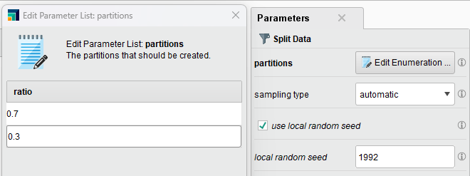
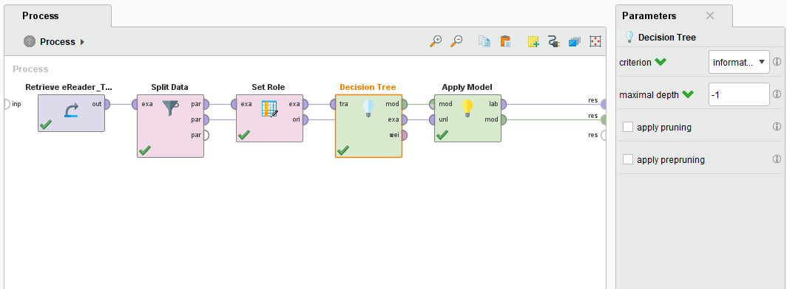
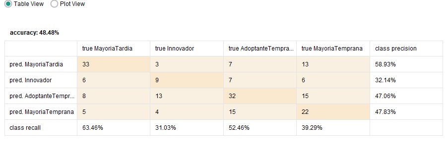
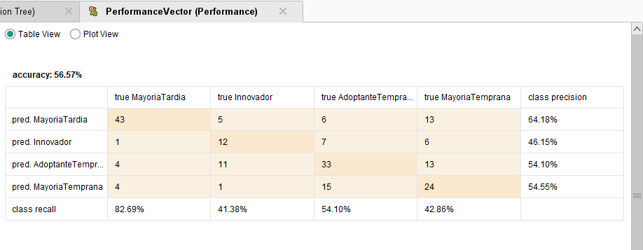
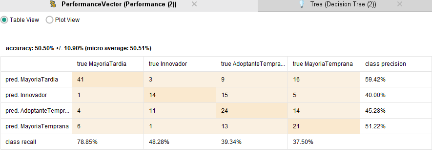

<h1> Unidad Temática 4 - Algoritmos no Lineales </h1>
<h2> Trabajo de Aplicación 3 Arboles de Decisión </h2>
<h2> Equipo 5 </h2>

<h2> Ejercicio 1 </h2>

 En este caso trabajaremos con el dataset de "eReader_training" que contiene información sobre los usuarios de un servicio de lectura de libros electrónicos. El objetivo es predecir si un usuario es o no un usuario Premium. 

 El dataset contiene 661 registros y 11 atributos. 

<h3> 1. Carga de datos </h3>

 Se introdujeron los datos en el RapidMiner, se observó que el dataset no contiene valores perdidos. Además que no se aprecian valores atípicos o nulos. 

<h3> 2. Split en Training y Prueba </h3>

 Se dividió el dataset en dos conjuntos, uno de entrenamiento y otro de prueba, con 70% y 30% respectivamente. 

<h3> 3. Construcción del modelo AD </h3>

 Al ajustar el AD con los siguientes valores:
    <ul>
        <li> Criterio: Information Gain </li>
        <li> Profundidad: -1 </li>
        <li> No pruning </li>
        <li> No prepruning </li>
    </ul>

 Se obtuvo el siguiente árbol: 

 Se observa que el árbol se vuelve muy complejo, por tener tantas ramas y nodos. 

<h3> 4. Evaluación del modelo </h3>

 Una vez que se setea el prepruning se obtienen diferentes valores de performance para el modelo. 

<stroke> Resultados con prepruning: </stroke>

TRAINING
| # | Accuracy | Error | Method |
| --- | --- | --- | --- |
| 1 | 52.25 | +- 4.85 | Standar no pruning o prepruning |
| 2 | 52.90 | +- 5.50 | Prepruning |
| 3 | 53.54 | +- 6.69 | Prepruning y pruning |
| 4 | 52.04 | +- 5.01 | Pruning- confidence 0.1 |
| 5 | 52.47 | +- 4.57 | Pruning- confidence 0.5 |

TEST
| # | Accuracy | Error | Method |
| --- | --- | --- | --- |
| 1 | 48.08 | +- 9.24 | Standar no pruning o prepruning |
| 2 | 47.05 | +- 8.38 | Prepruning |
| 3 | 47.05 | +- 8.38 | Prepruning y pruning |
| 4 | 48.08 | +- 9.24 | Pruning- confidence 0.1 |
| 5 | 48.02 | +- 9.24 | Pruning- confidence 0.5 |

 Se observa que el mejor resultado se obtiene con el prepruning y pruning, para el caso de Training. Y en caso de Test es igual el Standar con pruning de confidencia 0.1. 

