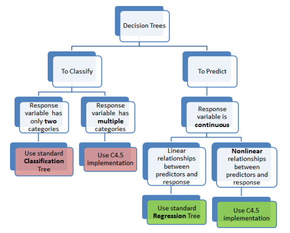
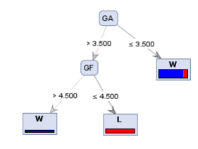

## Capítulo 1: ¿Qué son los Árboles de Clasificación y Regresión?
Aquellos que están comenzando a explorar las herramientas de análisis predictivo suelen estar confundidos por las docenas de técnicas disponibles que aparentemente abordan el mismo tipo de problema. La Clasificación (también conocida como Árbol de Decisión) y los Árboles de Regresión son probablemente una de las herramientas más comunes y fáciles de entender. Algunos proveedores se refieren a estas técnicas colectivamente como CART.

Existen varios tipos de "árboles" con los que los principiantes deben familiarizarse. De estos, dos tipos son probablemente los más significativos.

El primer tipo es un Árbol de Clasificación. También se le llama Árbol de Decisión por defecto. El otro árbol de decisión básico de uso común es un Árbol de Regresión, que también funciona de manera muy similar. Este capítulo resume las principales diferencias entre ellos: cuándo usar cada uno, en qué se diferencian y algunas precauciones.

Cuándo usar árboles de clasificación frente a árboles de regresión
Esto puede parecer un asunto trivial, ¡después de que comprendes la diferencia! Los árboles de clasificación, como su nombre indica, se utilizan para separar un conjunto de datos en clases pertenecientes a la variable de respuesta. Por lo general, la variable de respuesta tiene dos clases: Sí o No (1 o 0). Si la variable de respuesta tiene más de 2 categorías, se utiliza una variante del algoritmo llamada C4.5. Sin embargo, para divisiones binarias, se utiliza el procedimiento estándar de CART. Por lo tanto, los árboles de clasificación se utilizan cuando la variable de respuesta es de naturaleza categórica.
Los árboles de regresión son necesarios cuando la variable de respuesta es numérica o continua, por ejemplo, cuando se necesita predecir el precio de un producto de consumo basado en varios factores de entrada. Por lo tanto, los árboles de regresión son aplicables a problemas de tipo predictivo en contraposición a la clasificación.

Ten en cuenta que, en ambos casos, los predictores o variables independientes pueden ser categóricos o numéricos. Es la variable de destino la que determina el tipo de árbol de decisión necesario.

2: Cómo funcionan
En un árbol de clasificación estándar, la idea es dividir el conjunto de datos en función de la homogeneidad de los datos. Supongamos, por ejemplo, que tenemos dos variables: edad y peso, que predicen si una persona se va a inscribir en una membresía de gimnasio o no. Si en nuestros datos de entrenamiento se muestra que el 90% de las personas mayores de 40 años se inscribieron, dividimos los datos aquí y la edad se convierte en el nodo superior en el árbol. Casi podríamos decir que esta división ha hecho que los datos sean "90% puros". Se utilizan medidas rigurosas de impureza, basadas en el cálculo de la proporción de datos que pertenecen a una clase, como la entropía o el índice de Gini, para cuantificar la homogeneidad en los árboles de clasificación.

En un árbol de regresión, la idea es la siguiente: dado que la variable objetivo no tiene clases, ajustamos un modelo de regresión a la variable objetivo utilizando cada una de las variables independientes. Luego, para cada variable independiente, los datos se dividen en varios puntos de división. En cada punto de división, el "error" entre el valor predicho y los valores reales se eleva al cuadrado para obtener una "Suma de Errores Cuadrados (SSE)". Se comparan los errores en los puntos de división a lo largo de las variables, y se elige la variable/punto de división que produzca el SSE más bajo como el nodo raíz/punto de división. Este proceso se continúa de forma recursiva.

Un árbol de clasificación C4.5 (para más de 2 categorías de la variable objetivo) utiliza la ganancia de información para decidir qué variable dividir. En un árbol de regresión correspondiente, se utiliza la desviación estándar en lugar de la ganancia de información para tomar esa decisión. Los árboles de regresión, al usar modelos de regresión, pierden la ventaja de los árboles de decisión estándar: la capacidad de manejar parámetros altamente no lineales. En tales casos, puede ser mejor utilizar la implementación de tipo C4.5.

Este árbol a continuación resume a un alto nivel los tipos de árboles de decisión utilizados en la práctica.

## Capítulo 2: Ventajas de utilizar Árboles de Decisión para análisis predictivos

Existen varias ventajas distintas al usar árboles de decisión en muchas aplicaciones de clasificación y predicción. Aunque algunos proveedores utilizan nombres como Árboles de Clasificación y Regresión (CART o C&RT), siguen refiriéndose a la misma técnica analítica en su núcleo. Por lo tanto, simplemente los llamaremos Árboles de Decisión. Aquí tienes algunas de las ventajas de utilizar árboles de decisión en el análisis predictivo.

#### Ventaja 1: Los árboles de decisión realizan implícitamente la selección de variables o características
Explicamos en un artículo separado por qué la **selección de características es importante** en el análisis. También presentamos algunas técnicas comunes **para llevar a cabo la selección de características** o la criba de variables. Cuando ajustamos un árbol de decisión a un conjunto de datos de entrenamiento, los nodos principales en los que se divide el árbol son esencialmente las variables más importantes dentro del conjunto de datos, ¡y la selección de características se completa automáticamente!

#### Ventaja 2: Los árboles de decisión requieren relativamente poco esfuerzo por parte de los usuarios para la preparación de datos
Para superar las diferencias de escala entre parámetros, por ejemplo, si tenemos un conjunto de datos que mide los ingresos en millones y la edad de un préstamo en años, esto requerirá alguna forma de normalización o escala antes de que podamos ajustar un **modelo de regresión e interpretar los coeficientes.** Tales transformaciones de variables no son necesarias con los árboles de decisión porque la estructura del árbol será la misma con o sin la transformación. Otra característica que ahorra tiempo en la preparación de datos: los valores faltantes no impedirán la división de los datos para construir árboles. Los árboles de decisión tampoco son sensibles a los valores atípicos, ya que la división se produce en función de la proporción de muestras dentro de los rangos de división y no en valores absolutos.

#### Ventaja 3: Las relaciones no lineales entre parámetros no afectan el rendimiento del árbol
Como describimos **aquí, relaciones altamente no lineales** entre variables resultarán en fallos en modelos de regresión simples y harán que dichos modelos sean inválidos. Sin embargo, los árboles de decisión no requieren suposiciones de linealidad en los datos. Por lo tanto, podemos utilizarlos en escenarios donde sabemos que los parámetros están relacionados de manera no lineal.

#### Ventaja 4: La mejor característica de usar árboles en análisis: ¡son fáciles de interpretar y explicar a los ejecutivos!
Los árboles de decisión son muy intuitivos y fáciles de explicar, como muestra este árbol simple que muestra los factores que afectan a ganar (W) o perder (L). Sin embargo, todas estas ventajas deben ser moderadas por una desventaja clave de los árboles de decisión: sin una poda adecuada o limitación del crecimiento del árbol, tienden a sobreajustarse a los datos de entrenamiento, lo que los hace predictores relativamente pobres. En el próximo capítulo, examinaremos brevemente los algoritmos que permiten construir árboles de decisión.

## Capítulo 3: El núcleo técnico de los algoritmos de árboles de decisión

Los patrones a rayas en las cebras existen por varias razones: camuflaje, control de la temperatura corporal y, probablemente la más relevante para nosotros aquí, para la identificación. Los seres humanos también toman decisiones rápidamente identificando y emparejando patrones. Los patrones revelan rápidamente similitudes y diferencias. Si bien los patrones pueden contar una gran historia, la clave es convertir un patrón en un número o un conjunto de números que distingan un patrón de otro.

Técnicas de este tipo están disponibles en la teoría de la información. Formulaciones como la entropía y la información mutua encapsulan estas ideas. (Este video explica en un minuto cómo puede funcionar la entropía para medir la incertidumbre. Puedes continuar leyendo a continuación o ver el video).

Imagina una caja que puede contener una de tres bolas de colores en su interior: roja, amarilla y azul. Sin abrir la caja, si intentaras adivinar de qué color es la bola que está dentro, básicamente estás lidiando con la incertidumbre. Ahora, ¿cuál es el número máximo de preguntas "sí/no" que se pueden hacer para reducir esta incertidumbre?
¿Es roja? No.
¿Es amarilla? No.
Entonces debe ser azul. Eso son dos preguntas. Si hubiera un cuarto color, verde, entonces el número máximo de preguntas (sí/no) es tres. Si extendemos este razonamiento, se puede mostrar matemáticamente que el número máximo de preguntas binarias necesarias para reducir la incertidumbre es esencialmente log (T), donde el logaritmo se toma en base 2 y T es el número de resultados posibles. (Ejemplo: Si solo tienes 1 resultado, entonces log(1) = 0, lo que significa que no hay incertidumbre). Si hay T eventos con igual probabilidad de ocurrencia, entonces T = 1/P.

Claude Shannon utilizó esta idea para definir la entropía como log(1/P) o -log(P), donde P es la probabilidad de que ocurra un evento. Si la probabilidad de todos los eventos no es idéntica, necesitamos una expresión ponderada y, por lo tanto, la entropía, H.

H = -Sumatoria (pi log pi)

La entropía es una herramienta muy útil para cualquier profesional de análisis predictivo o gestión de riesgos. Una aplicación muy común de la entropía de la información es la construcción de árboles de decisión. Las principales ideas detrás del uso de la entropía para construir un árbol de decisión son las siguientes:

1. Utilizando la entropía de Shannon, ordena el conjunto de datos en variables homogéneas y no homogéneas. Las variables homogéneas tienen una entropía baja y las variables no homogéneas tienen una entropía alta.
2. Pondera la influencia de cada variable independiente en la variable objetivo o dependiente utilizando el concepto de entropía conjunta.
3. Calcula la ganancia de información, que es esencialmente la reducción de la entropía de la variable objetivo debido a su relación con cada variable independiente. Esto es simplemente la diferencia entre la entropía de la variable objetivo encontrada en 1 menos la entropía conjunta calculada en 2.
4. La variable independiente con la mayor ganancia de información se convertirá en la "raíz" o el primer nodo en el que se divide el conjunto de datos.
5. Repite este proceso para cada variable para la cual la entropía de Shannon no es cero. Si la entropía de una variable es cero, esa variable se convierte en un nodo "hoja".

En los tres capítulos siguientes, describiremos cómo utilizar RapidMiner, el software de minería de datos de código abierto, para construir árboles de decisión y realizar puntuación de crédito.

