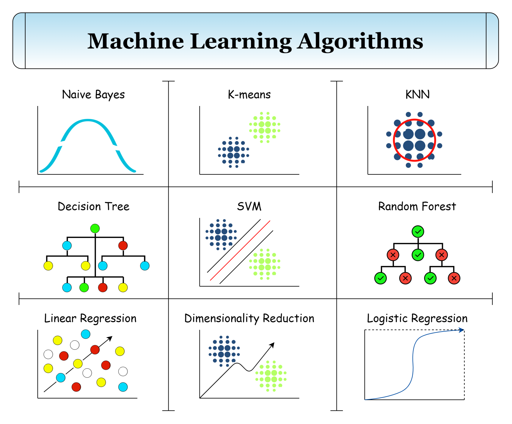
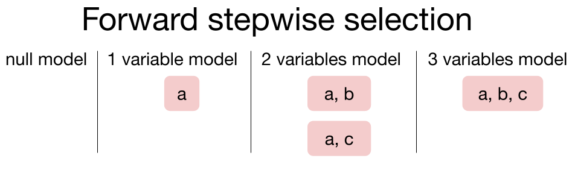
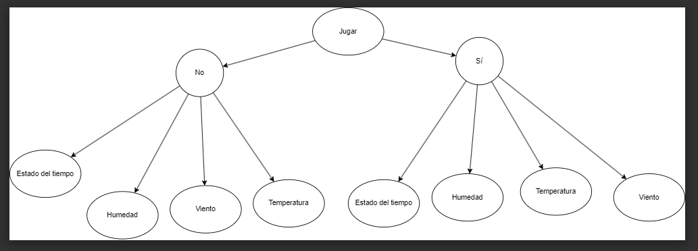

# Unidad Temática 4 - Algoritmos No Lineales Nayve Bayes, K-NN y Feature Selection.

## Objetivos

En esta unidad de aprendizaje se abordarán diversos algoritmos no lineales de aprendizaje automático, analizando su aplicabilidad a diversos problemas y los requerimientos que imponen en la preparación previa de los datos involucrados.

También se abordan las técnicas modernas utilizadas para la selección de atributos ("feature selection")

### Resultados Esperados del aprendizaje
Al culminar esta unidad de aprendizaje serás capaz de:

- Discutir los fundamentos y limitaciones de algoritmos basados en “Naive Bayes”

- Implementar modelado y aprendizaje basados en Naive Bayes

- Implementar predicciones basadas en en Naive Bayes

- Discutir los fundamentos de los métodos de "vecinos más cercanos", tanto para modelos de clasificación como de regresión.

- Implementar modelado, aprendizaje y predicción utlizando k-NN

- Aplicar técnicas modernas y efectivas para las selección de atributos en conjuntos de datos

- Evaluar estrategias más sofisticadas de validación de modelos de ML

- Tópicos

**Naive Bayes**

- Preparación de los datos y representación de modelos basados en Naive Bayes

- Aprendizaje del modelo a partir de los datos.

- Aplicación del modelo Naive Bayes para hacer predicciones

 

**k-Nearest Neighbors**

- Representación utilizada para k-NN

- Aprendizaje del modelo k-NN a partir de los datos

- Utilización de un modelo k-NN aprendido para hacer predicciones sobre nueva información (clasificación y regresión)

- Requerimientos de preparación previa de los datos para el algoritmo k-NN

- Técnicas de selección de atributos

### Lectura básica inicial
- Libro Predictive Analytics and Data Mining_ Concepts and Practice with RapidMiner [Kotu & Deshpande] (o la 2da edición, ["Data Science, Concepts and Practice"](../BibliografiaCurso/Data-Science-Concepts-and-Practice-2nd-Edition-3.pdf))
    +  Capítulo 4.3 “k-Nearest Neighbors”

    +  Capítulo 4.4 “Naïve Bayes”

    +  Capítulo 12 "Feature Selection" (o cap. 14 en la 2da edición)

- Tutorial de Feature Selection - Despande
  
**Videos RapidMiner:**

- [Naïve Bayes ](https://www.youtube.com/watch?v=IlVINQDk4o8)

- [5 Minutes With Ingo: Understanding K Nearest Neighbors Algorithms](https://www.youtube.com/watch?v=mpmf1T6-8wM)

- [k-NN](https://www.youtube.com/watch?v=JeYcRR_RG9k)

- [Arboles de Clasificación y KNN para Clasificación](https://www.youtube.com/watch?v=GkocaMmsR9Y)

- [KNN para Predicción ](https://www.youtube.com/watch?v=V-0Lf5-vAcI)

## Actividades :page_facing_up:

### Actividad 10

- [ ] Realizar el [Trabajo de aplicación 10](./Ejercicios/ut4-ta10-eq5.docx) de la unidad temática 4.

En este ejercicio se realiza el trabajo de Feature Selection, utilizando el algoritmo de selección de atributos "Correlation Feature Selection" (CFS) y el algoritmo de clasificación "k-Nearest Neighbors" (k-NN). Se utiliza el conjunto de datos Sonar de RapidMiner.

Los modelos aplicados incluyen:

- Forward Selection 
- Backward Elimination

**Forward Selection**: Se comienza con un conjunto vacío de atributos y se agrega uno a uno los atributos que mejoran el modelo. Se detiene cuando no se puede mejorar el modelo agregando más atributos.

**Backward Elimination**: Se comienza con el conjunto completo de atributos y se elimina uno a uno los atributos que no mejoran el modelo. Se detiene cuando no se puede mejorar el modelo eliminando más atributos.

La gran diferencia está en cómo empiezan a armar el modelo. Con Forward Selection, empiezan con nada y le van añadiendo variables una por una para ver si mejoran el modelo. En cambio, con Backward Elimination, empiezan con todas las variables y van quitando una por una para ver si mejora. En pocas palabras, Forward Selection parte de cero, mientras que Backward Elimination empieza con un modelo lleno y lo simplifica de a poquito. Esto puede afectar cómo de rápido corre el modelo y qué tan bien funciona. Cuál de estos métodos usar depende de los datos y lo que quieras lograr con el modelo.

### Actividad 5

- [ ] Realizar el [Trabajo de aplicación 5](./Ejercicios/TA5–Ej1.pdf ) de la unidad temática 4.

Estudio del algoritmo de Naive Bayes, utilizando el conjunto de datos "Golf". Se realiza el estudio de la probabilidad de cada atributo, la probabilidad de cada atributo dado el valor de la clase, y la probabilidad de cada clase. Se realiza la predicción de la clase para un nuevo caso.

Este algoritmo aplicado al dataset, nos permite predecir si se puede jugar al golf o no, en función de las condiciones climáticas. Para ello, se calcula la probabilidad de cada atributo, la probabilidad de cada atributo dado el valor de la clase, y la probabilidad de cada clase. Se realiza la predicción de la clase para un nuevo caso.

La imagen permite ver el árbol generado y la probabilidad de cada clase.

### Actividad 4

Archivo excel con los valores de las probabilidades: [Probabilidades](./Ejercicios/EjemploPlayTennis-TA4-clase.xlsx)

Estudio algoritmos no lineales, Naive Bayes aplicado al dataset Jugar al Tenis. Se realiza el estudio de la probabilidad de cada atributo, la probabilidad de cada atributo dado el valor de la clase, y la probabilidad de cada clase. Se realiza la predicción de la clase para un nuevo caso.

Es importante recalcar que el algoritmo Naive Bayes, es un algoritmo de clasificación, que se basa en el teorema de Bayes, el cual se basa en la probabilidad condicional, es decir, la probabilidad de que ocurra un evento A, dado que ha ocurrido un evento B.

