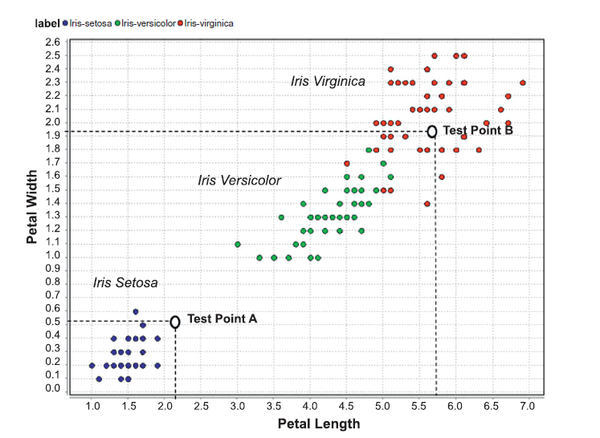

# Unidad 4 - Resumen

## K-Nearest Neighbors

La ciencia de predicción de datos, utiliza arboles de decisión y técnicas de reglas de inducción.
Esta alternativa adopta una postura diferente porque, no aprende el dataset. Contrario a otras aproximaciones que se memorizan el dataset, llamadas lazy learns
Se puede llamar K-NN el dataset de entrenamiento  es "memorizado" y cuando es necesario clasificar registros de ejemplos sin etiquetar, los atributos de entrada de los nuevos registros sin etiquetar son comparados contra los del dataset de entrenamiento completos para encontrar un match cercano.
Cuando se tiene un registro con más de una especie de vecino cercano, se utiliza el voto de la mayoría para determinar la clase del registro sin etiquetar. Es necesario un algoritmo que resuelva los casos bordes y las mediciones sin acercamiento de los puntos de datos con mas de 2 dimensiones. Una técnica es concontrar lospuntos mas cercanos de la training data desde data point de pruebas no visto, en espacios multidimencionales. Asi funciona el algoritmo K-NN.
La K en el algoritmo indica el numero de registros de entrenamiento cercanos que se utilizaran para determinar la clase del registro sin etiquetar. El algoritmo K-NN es un algoritmo de clasificación supervisado. El algoritmo K-NN es un algoritmo de clasificación supervisado. El algoritmo K-NN es un algoritmo de clasificación supervisado. El algoritmo K-NN es un algoritmo de clasificación supervisado. El algoritmo K-NN es un algoritmo de clasificación supervisado. El algoritmo K-NN es un algoritmo de clasificación supervisado. El algoritmo K-NN es un algoritmo de clasificación supervisado. El algoritmo K-NN es un algoritmo de clasificación supervisado. El algoritmo K-NN es un algoritmo de clasificación supervisado. El algoritmo K-NN es un algoritmo de clasificación supervisado.

K=1, busca el primer registro y adopta la etiqueta de clase del primer registro de entrenamiento como el valor de la clase objetivo predicto.

### Medicion de proximidad:

La medida de proximidad entre 2 registros es una medida de proximidad entre atributos. Se pueden usar tecnicas para medir como: calcular la distancia, correlacion, Jaccard Similarity, similitud de coseno, etc.

**Distancia**

$X(x_1, x_2)$ e $Y(y_1, y_2)$ son 2 puntos en un plano 2D. La distancia entre ellos es:

$d(X,Y) = \sqrt{(x_1 - y_1)^2 + (x_2 - y_2)^2}$

Ej. $X=(4.9, 3.0, 1.4, 0.2)$ e $Y=(4.6, 3.1, 1.5, 0.2)$

$d(X,Y) = \sqrt{(4.9 - 4.6)^2 + (3.0 - 3.1)^2 + (1.4 - 1.5)^2 + (0.2 - 0.2)^2} = 0.316$

Las entradas en K-NN son normalizadas para que todas las entradas tengan el mismo peso. Se encuentran los MAX y MIN de cada atributo y se escalan entre 0 y 1. Normalmente se utiliza Z-Transform para esto.

La Distancia Euclidiana es la más comun para atributos numericos y se pueden sumar Manhattan y Chebyshev.

Manhattan: $d(X,Y) = |x_1 - y_1| + |x_2 - y_2|$

Chebyshev: $d(X,Y) = max(|x_1 - y_1|, |x_2 - y_2|)$

**Weights** 

Tiene relacion con la concentracion de los vecinos cercano con la misma clase.

$W_i$ => es proporcional a la distancia de los puntos de prueba desde el vecino
    => la suma de todos los pesos debe ser 1

$W_i = \frac{e^{-d(x, n_i)}}{\sum_{i=1}^{k} e^{-d(x, n_i)}}$

$W_i$ es el paseo del i-esimo vecino cercano en $n_i$,  $k$ es ek total de vecinos $x$ es el datapoint de prueba. El peso se utiliza para predecir el objetivo de la calse $Y'$

$Y' = ClaseMayor(w_1*y_1, w_2*y_2, ... , w_k*y_k)$

$y_i =$ es la calse de salida del vecino $n_i$